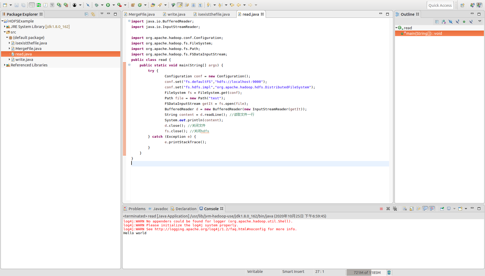
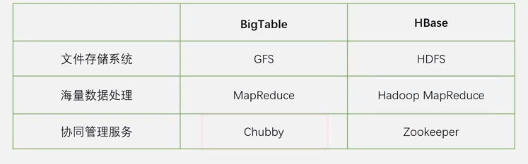
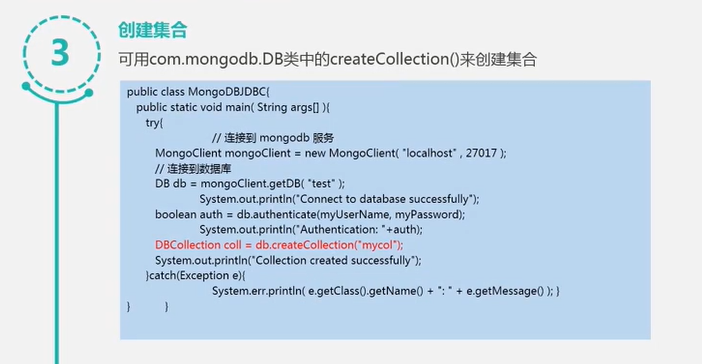
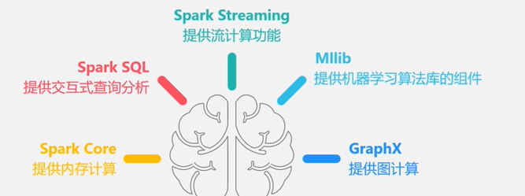
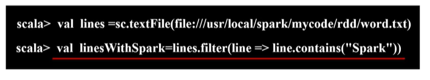
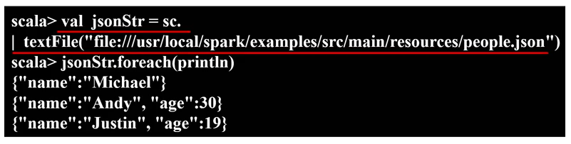

# 大数据概述

## 大数据概念和影响

### 大数据特点：

- 大量化（volume）：大数据摩尔定律
- 快速化（velocity）：数据处理速度快
- 多样化（variety）：大数据由结构化和非结构化数据组成
- 价值密度低（value）

### 大数据影响

四种数据范式：实验、理论、计算、数据

在思维方式方面，大数据完全颠覆了传统的思维方式：

全样而非抽样（抽取数据计算分析）众多服务器的集群出现使得不需要抽样

效率而非精确：抽样分析追求精确度是因为如果抽样精确度不高放在全样将被放大

相关而非因果：

## 大数据关键技术

大数据技术层次：

- 数据采集
- 数据存储与管理
- 数据处理与分析
- 数据隐私与安全

> 分布式存储：解决海量数据存储问题
>
> 分布式处理：解决海量数据处理问题

不同的计算模式需要不同的产品如：

批处理：时效性要求无法满足

- MapReduce
- Spark—时效性比mapreduce高，可以高效迭代计算，适合数据挖掘

流计算：实时处理给出实时响应

图计算：高效处理图结构数据比如社交网络数据

查询分析计算：交互式查询，大数据查询分析软件

- Hive


## 大数据与云计算、物联网

### 云计算

> 通过网络以服务的方式为用户提供非常廉价的IT资源

云计算解决两个核心问题：海量数据分布式存储和处理

云计算特征：虚拟化、多租户

1. 公有云：面向所有用户
2. 混合云
3. 私有云：面向企业内部

云计算层次模型：

- 基础设施层 IaaS：面向网络架构师

  将基础设施作为服务出租

- 平台层PaaS：面向应用开发者，平台即服务

  开发云计算产品，平台作为服务

- 应用层SaaS：面向用户，软件即服务

  云财务软件

#### 虚拟化技术


> VPN

#### 云计算数据中心

### 物联网 IoT

物物相连互联网

#### 层次架构


### 关系


# 大数据处理架构Hadoop

## 概述

> 分布式计算平台，java语言开发，跨平台，支持多种编程语言

**两大核心：HDFS（分布式存储） + MapReduce（分布式处理）**

### 特点

- 高可靠性：多台机器构成集群，部分机器发生故障，剩余机器可以继续对外提供服务
- 高效性
- 高可扩展性
- 成本低：采用普通pc机构成一个集群

架构：

 

### 版本

- 1.0：

  

  mapreduce:需要数据处理分析以及集群资源调度

  因此2.0把任务分解，使得mapreduce只进行数据处理，由yarn来进行资源调度

- 2.0

  HDFS在1.0可扩展性并不好，因此2.0实现多个namenode分区管理

  

  

## 各组件、功能

### 项目结构

HDFS + MapReduce


> HDFS：分布式文件存储；YARN：计算资源调度；MapReduce：离线计算，基于磁盘；Tez：MapReduce作业进行分析优化，构建有向无环图，实现高效；Spark：通用并行框架，基于内存计算，性能优于MapReduce；Hive：数据仓库功能，用于企业决策分析，可以把sql语句转成MapReduce作业；Pig：实现流数据处理，基于大规模数据分析平台，轻量级分析；Oozie：作业流调度系统，工作流管理；zookeeper：提供分布式协调一致性服务，协同工作系统，分布式锁；HBase：列族数据库，支持随机读写，非关系型分布式数据库；Flume：日志收集分析框架；Sqoop：数据导入导出，用于在Hadoop与传统数据库之间进行数据传递；Ambari：部署工具

# 分布式文件系统HDFS

## 概述

HDFS-Hadoop Distributed File System

> 大数据时代，海量数据需要集群分布式存储

**集群基本架构：**


> 机架内部机器通过光纤高速交换机连接，机架与机架之间由带宽更高的光纤交换机连接

**文件系统结构：**

文件分布式存储


### HDFS实现目标

- 兼容廉价的硬件设备（需要成本低，普通的pc机）
- 流数据读写（传统文件系统一般块为单位，HDFS是全部数据全部读写，批量处理）
- 支持大数据集
- 支持简单的文件模型（对文件简化，牺牲相关性能，获取批量处理特性，只允许追加不允许修改）
- 跨平台兼容性

### 局限性

- 不适合低延迟数据访问（面向大规模数据流式读写，无法精确定位某个数据，不适合实时处理需求，而hbase可以）
- 无法高效储存大量小文件（使用元数据指引，其保存在的namenode中，内存中检索，需要建立索引结构，小文件多索引结构将变庞大从而耗时大）
- 不支持多用户写入及任意修改文件（只允许追加）

### 相关概念

#### 块

为了分摊磁盘读写开销，即在大量数据间分摊磁盘寻址开销

但是HDFS的一个块比普通文件系统的块大很多，一般64MB甚至128MB

> 这样可以支持面向大规模数据存储、降低分布式节点的寻址开销（三级寻址：元数据、数据节点、取数据）
>
> 缺点：块过大将导致mapreduce只有一两个任务执行，牺牲了并行度发挥不了分布式并行处理效果
>
> 好处：支持大规模文件存储；简化系统设计；适合数据备份

#### 两大组件

---名称节点namenode、 数据节点datanode


名称节点承担整个HDFS集群的管家任务

数据节点具体负责存储实际数据，存在磁盘中，本地的linux文件系统中

##### 元数据

1. 文件是什么
2. 文件被分成多少块
3. 块和文件的映射关系
4. 每个块被存储在哪个服务器上

##### 名称节点

###### FsImage

保存系统文件树以及文件树中所有文件数据

文件复制等级、修改和访问时间、访问权限、块大小以及组成文件的块（不记录在哪块数据节点，而是单独维护）

>  数据节点会向管家汇报保存了什么数据块，即实时沟通维护保存在内存中

###### EditLog

记录对数据进行的操作，也在内存中，规模小，操作效率高

###### 如何处理


每次启动，后台将FsImage从底层磁盘读到内存，元数据信息都要保存到内存，与EditLog各项操作合并，FsImage记录历史数据结构信息，而修改由EditLog记录，合并后才能得到最新的元数据，从而得到新版的FsImage，然后创建一个空的EditLog

> 因此每次更新用EditLog记录，如果直接修改FsImage将会运行很慢

###### 第二名称节点

对于不断的操作EditLog会不断增大，第二名称节点可以解决这个问题，当然它也有对名称节点冷备份的功能


> EditLog会不断增大，第二名称节点定期和名称节点通信，某个阶段让名称节点停止使用EditLog文件，将EditLog、Fsimage存入自己机器，名称节点会建立新的Edits（记录维护期间操作），第二名称节点把editlog和fsimage导入本地后合并成新的fsimage再发送给名称节点，名称节点得到合并后的大的fsimage，然后把edit.new更改为editlog，维护期间editnew记录了维护期间操作，从而实现了edit fsimage合并也实现了冷备份效果


##### 数据节点

负责具体数据存储，每个数据节点数据保存到各自本地的linux文件系统中

## 体系结构

HDFS采用主从架构

### HDFS命名空间管理

包含目录、文件、块

访问HDFS文件系统/ + 目录名称

### 通信协议

所有HDFS通信协议都构建在TCP/IP基础之上

客户端使用客户端协议和名称节点交互

名称节点和数据节点交互用数据节点协议

客户端和数据节点通过远程调用RPC实现

### 局限性（1.0）

- 命名空间限制：名称节点保存在内存中，名称节点能够容纳对象个数受到空间大小限制
- 性能瓶颈：整个分布式文件吞吐量受限于单个名称节点吞吐量
- 隔离问题：由于集群中只有一个名称节点一个命名空间，因此无法对不同应用程序隔离
- 集群的可用性：一旦唯一的名称节点发生故障整个集群无法使用（第二名称节点是冷备份），单点故障（2.0解决，设置多个名称节点并且加入热备）


## 存储原理

### 冗余数据保存

廉价机器集群容易不断出现故障，那么需要冗余数据，每个数据以快为单位被冗余保存（默认保存3份）

伪分布时：冗余只能为1

**好处：**

- 加快数据传输速度（因为多个客户端发起访问，可以实现并行操作）
- 容易检查数据错误（互为备份做参照）
- 保证数据可靠性

### 数据保存策略


> 每个节点都是廉价机器
>
> **存储**，多份副本的放置：
>
> 1. 第一份放上传文件的数据节点（不需要通过网络）
>
>    如果提交数据的请求不在集群内部，则随机挑选磁盘不满CPU不忙节点
>
> 2. 第二份放与第一份所在机架不同的节点上
>
> 3. 第三份放与第一份所在机架相同机架的不同节点上
>
> 4. 后续多份随机
>
> **读取**，*就近*读取，网络开销小
>
> 确定就近：
>
> 
>
> 当客户端读取数据，从名称节点获得数据块不同副本的存放位置列表，列表中包含了副本所在数据节点，调用API确定节点所属机架ID，当发现数据块副本对应机架ID和客户端对应机架ID相同就优先选择该副本读取数据，否则随机选择

### 数据恢复

#### 名称节点的出错

名称节点会做冷备份，当出错时，整个HDFS实例将失效，出了问题将会暂停服务一段时间，从第二名称节点做恢复，恢复后再开始服务(1.0，2.0马上热备)

#### 数据节点的出错

数据节点具体负责存储相关数据，那么**如何知道出错**：因为数据节点会定期（远程调用）对名称节点发送***心跳信息***示意自己的状态（收不到则发生故障）。

**处理**：当发生故障名称节点对其标记宕机，把存储在故障机上数据重新分发到可用机上，因为之前冗余备份过，所以可以实现重新分发（可以调整冗余数据位置，当负载不均衡时也可以调整）

#### 数据本身的出错

数据块存储到不同服务器上会出现磁盘损坏的情况，导致数据错误

**如何知道**：使用校验码，客户端读取数据后对数据进行校验码校验，校验码是在文件被创建时客户端写文件时为数据块分配的，读出数据后进行校验码计算，从而进行比较

出错后进行冗余数据的恢复

## 数据读写

### 读过程

- 打开文件


- 获取数据块信息


> DFSInputStream询问名称节点，通过接口，名称节点返回信息

- 读取请求

read函数读取，读后关闭与数据节点的连接

- 获取数据块信息(可能发生)

数据节点读后可能有剩余数据没有读完，因此可能还需要获取下一个数据的存储信息


- 再次读取数据

- 关闭文件

循环读完后close关闭

### 写过程


- 创建文件请求

  DFSOutputStream与名称节点交流

- 创建文件元数据

  询问名称节点文件写在什么数据节点

  DFSOutputStream执行RPC远程调用，让名称节点在文件系统命名空间新建文件，名称节点检查文件是否存在以及权限检查，然后创建文件

- 写入数据、写入数据包

  通过输出流，高效的方式是流水线复制：把数据分包，分包放入输出流的内部队列，放入后输出流会向名称节点申请数据节点。**数据节点构成数据流管道**，内部队列的分包会打包为数据包发送到整个数据流管道第一个节点，由第一个节点发给下一个节点，以此类推，形成流水线

  

- 接受确认包

  由最后一个数据节点开始往前传

  

- 关闭文件、写操作完成

## HDFS常用命令

启动: ./sbin/start-dfs.sh

hadoop dfs / hadoop fd / ./bin/hdfs dfs 

停止:./sbin/stop-dfs.sh

- fs支持命令


- 首次使用HDFS，创建用户目录

  ```shell
  $ ./bin/hdfs dfs -mkdir -p /user/hadoop
  ```

  > 该命令表示中HDFS中创建一个目录，“-p”表示如果是多级目录，则父目录和子目录一起创建，这里“/user/hadoop”就是一个多级目录，因此必须使用参数“-p”，否则会出错

- 创建、删除都和linux命令差不多，需要注意的是地址，如果是"."表示的是上面创建的目录，如果是“/”表示HDFS根目录

### 文件操作

从本地文件系统向HDFS中上传文件，或者把HDFS中的文件下载到本地文件系统

- 将本地文件上传到HDFS指定目录-put

  

- 将HDFS文件下载到本地-get

  

- 对于把HDFS目录下一个文件拷贝到另一个目录，操作与linux查不多，加入前缀hadoop -dfs即可

### 利用Web界面管理HDFS

> http://localhost:9870/dfshealth.html#tab-overview

## HDFS常用JAVA API

Hadoop API文档

http://hadoop.apache.org/docs/stable/api/

### 应用程序的部署

把Java应用程序生成JAR包，部署到Hadoop平台上运行

export -> java -> runnable jar file

- launch configuration:生成jar包被部署启动时运行的主类
- export destination:jar包输出目录


**执行：**

使用hadoop jar运行程序


### 练习

#### 写入文件

```java
import org.apache.hadoop.conf.Configuration;  
import org.apache.hadoop.fs.FileSystem;
import org.apache.hadoop.fs.FSDataOutputStream;
import org.apache.hadoop.fs.Path;
public class write {
	public static void main(String[] args) { 
        try {
                Configuration conf = new Configuration();  
                conf.set("fs.defaultFS","hdfs://localhost:9000");
                conf.set("fs.hdfs.impl","org.apache.hadoop.hdfs.DistributedFileSystem");
                FileSystem fs = FileSystem.get(conf);
                byte[] buff = "Hello world".getBytes(); // 要写入的内容
                String filename = "test"; //要写入的文件名
                FSDataOutputStream os = fs.create(new Path(filename));
                os.write(buff,0,buff.length);
                System.out.println("Create:"+ filename);
                os.close();
                fs.close();
        } catch (Exception e) {  
        		System.out.println("failed");
                e.printStackTrace();  
        }  
	} 
}
```

result:


#### 判断文件是否存在

```java
import org.apache.hadoop.conf.Configuration;
import org.apache.hadoop.fs.FileSystem;
import org.apache.hadoop.fs.Path;
public class isexistthefile {
	public static void main(String[] args) {
        try {
                String filename = "test";

                Configuration conf = new Configuration();
                conf.set("fs.defaultFS","hdfs://localhost:9000");
                conf.set("fs.hdfs.impl","org.apache.hadoop.hdfs.DistributedFileSystem");
                FileSystem fs = FileSystem.get(conf);
                if(fs.exists(new Path(filename))){
                        System.out.println("文件存在");
                }else{
                        System.out.println("文件不存在");
                }
                fs.close();
	    } catch (Exception e) {
	            e.printStackTrace();
	    }
	}
}

```


#### 读取文件

```java
import java.io.BufferedReader;
import java.io.InputStreamReader;
 
import org.apache.hadoop.conf.Configuration;
import org.apache.hadoop.fs.FileSystem;
import org.apache.hadoop.fs.Path;
import org.apache.hadoop.fs.FSDataInputStream;
public class read {
	public static void main(String[] args) {
        try {
                Configuration conf = new Configuration();
                conf.set("fs.defaultFS","hdfs://localhost:9000");
                conf.set("fs.hdfs.impl","org.apache.hadoop.hdfs.DistributedFileSystem");
                FileSystem fs = FileSystem.get(conf);
                Path file = new Path("test"); 
                FSDataInputStream getIt = fs.open(file);
                BufferedReader d = new BufferedReader(new InputStreamReader(getIt));
                String content = d.readLine(); //读取文件一行
                System.out.println(content);
                d.close(); //关闭文件
                fs.close(); //关闭hdfs
        } catch (Exception e) {
                e.printStackTrace();
        }
	}
}

```

result:



# 分布式数据库HBase

## 概述

分布式存储系统支持PB级别数据，可以存储几千台服务器具有高可扩展性

**特点：**：高可靠性、高性能、面向列、可伸缩

HBase分布式数据库可以用来存储非结构化和半结构化松散数据

HBase和BigTable的底层技术对应关系：



> HBase架构在底层分布式文件系统HDFS之上，是BigTable 的开源实现

HBase：虽然有了HDFS和MapReduce，但是Hadoop主要解决大规模数据离线批量处理，没有办法满足大数据实时处理需求。而随着数据规模爆炸式增长，传统关系型数据库扩展能力非常有限，另外很多数据的结构会变化，而传统关系型数据库模式很难变化。

### HBase和传统关系型数据库的联系和区别

- 数据类型

  传统关系数据库用非常经典的关系数据模型

  hbase数据模型简单，将数据存储为未经解释的字符串即字节数组，由应用程序开发人员来解释

- 数据操作

  关系数据库多种操作而hbase操作简单，不对数据规范化

- 存储模式

  hbase基于列存储

- 数据索引

  关系数据库可以直接针对各个不同列构建复杂索引

  hbase原始设计只支持对行键的简单索引

- 数据维护

  关系数据库做一些更新操作时，旧值被覆盖

  hbase不存在替换，旧版本会保存只会定期清理

- 可伸缩型

  关系数据库很难水平扩展，只能变多核等方式纵向扩展，而hbase是借助分布式集群存储海量数据，水平可扩展性好

### HBase访问接口

- 提供了一个原生JAVA API
- Shell
- Thrift Gateway
- REST Gateway
- 提供sql类型接口 
- pig
- 数据仓库产品hive（hive sql）


## 数据模型

HBase是一个稀疏的多维度的排序的映射表


- 每个值都是未经解释的字符串也就是Bytes数组,单元格具体存储数据

- 一行可以有一个行键和任意多个列族，以列族为单位存储，不同列族存在不同文件,列可以增加或删除

- 列族支持动态扩展，执行数据更新操作会保留旧版本，因为架构在HDFS上，没有办法直接修改数据，只能加入时间戳

  > 时间戳：数据更新，旧版本会保留，新版本通过时间戳来进行区分，因此一个单元格可能有非常多版本数据保存按时间戳

- HBase不考虑冗余，追求分析效率

### 数据坐标

传统关系数据库只要通过一个行一个列两个维度就可以确定一个唯一数据

而HBase(键值数据库)对数据的定位采用四维坐标:**`行键 列族 列限定符 时间戳`**

### 概念视图


可以看出hbase是一个稀疏表

**但是底层存储是按列族存储**

### 物理视图


> 按列族存储

传统的面向行存储是对于传统的**事务型**操作,但是做**分析**时候,比如性别特征,针对一个列分析,此时列式存储占据优势,并且按列存储可以带来很高的数据压缩率.


## 实现原理

### 功能组件

#### 库函数

链接每个客户端

#### master服务器

管家

- 对分区信息维护和管理
- 维护一个Region服务器列表,可以查看region服务器状态
- 负责对region分配
- 负载均衡

#### region服务器

负责存储不同的region

客户端要访问数据也是在region对数据存取,不依赖master获取位置信息

### 核心概念表与Region

一个HBase表被划分为多个Region

一个region会分裂成多个新的region,分裂时不进行物理分割,修改指向信息即可,实现快速分裂.同一个region不可能分裂到不同的region服务器上


> region的实际大小取决于单台服务器的有效处理能力,最佳配置为1GB-2G
>
> 每一个region服务器大概存储10-1000个region


### Region定位

> 首先构建了一个元数据表,一列记录region id 另一列记录region服务器id
>
> hbase最开始创建时有一个映射表,称为.META. 表,用于存储元数据

HBase设计三层结构实现region寻址与定位


> -ROOT-最多一个region不再分裂,记录元数据表元素信息存储在哪,.META.记录具体数据位置
>
> 实际存储时-ROOT-表地址记录在ZooKeeper中(写死),然后根据地址找到.META.,然后找到用户数据表
>
> 
>
> .META.所有内容存储在内存中,因此需要考虑大小

另外,为了加速寻址,客户端会缓存位置信息,同时需要解决缓存失效问题,采用惰性解决方式,只有发现找不到时才再次三级寻址


## 运行机制

### 系统架构


HBase并不直接和底层磁盘联系

> - 客户端:访问HBase接口,会维护访问region的信息
>
> - zookeeper:实现协同管理服务,大量用于分布式计算,提供配置维护,域名服务,分布式同步服务,维护整个hbase集群
>
> - master(主服务器):负责hbase表的操作以及region管理,负责不同region服务器的负载均衡,负责调整分裂\合并后region的分布,负责重新分配故障\失效的region服务器
>
> - region服务器:负责用户数据存储和管理
>
>   
>
>   每个region服务器有很多region,多个region共用一个Hlog文件,每个region按列族切分,每个列族会单独构成一个store,而每个store并不直接与底层连接,而是先写入memstore缓存中,缓存满后刷写到storefile(底层是通过hdfs存储(hfile格式))中


### Region服务器工作原理

#### 用户读写数据过程

写:


读:

先读缓存再读磁盘的storefile


#### 缓存刷新


### Store工作原理

#### StoreFile合并

当磁盘中刷写生成的storefile达到一定阈值才会合并,但是合并到一定程度后会触发分裂,一个region分裂为两个region


### HLog工作原理

HBase是构建一个集群管理数据,典型的分布式环境,底层使用的是非常廉价的低端机,故障是难免的,为了保证数据恢复需要采用日志方式,因此每次需要写入日志后再写入缓存


### zookeper

zookeeper监视整个集群.发现故障,监听region服务器,发现故障告诉master,master进行处理,通过日志进行恢复,对hlog拆解,把属于各个region的log分配出来,把发生故障的region分配给可用的region服务器通过log恢复.**为了提高表的写操作性能**所以才只分配一个hlog.所以拆解比较耗时,故障只是少部分情况.

## HBase应用方案

### 性能优化方法

- 时间靠近数据存在一起:把时间戳包含在行键中,按升序排序,越后时间戳越大,因此需要反过来排序

  

- 提升读写性能

  根据需要决定是否放入缓存

  

- 设置最大版本,保存最新版本的数据参数设为1,节省存储空间

  HColumnDescriptor.setMaxVersionsMaxVersions

- 数据自动清理

  TimeToLive,一旦超过生命周期成为过期数据自动被系统删除

  setTimeToLive(2 * 24 * 60 * 60)


### 检测性能

工具:

- Master-status:浏览器查询hbase运行状态
- ganglia
- opentsdb
- ambari

### 构建sql引擎和HBase二级索引

#### sql引擎

sql语句查询hbase相关数据

引擎:hive  phoneix

#### HBase二级索引(辅助索引)

> hbase默认只支持对行键进行索引.而实际应用要对不同列构建索引,因此可以采用coprocessor,如华为的hindex以及redis和solr

coprocessor提供了两个实现endpoint和observer

- endpoint:相当于关系型数据库的存储过程
- observer:相当于触发器

> 从而hbase可以有主表和索引表,(引擎构建在hbase之上,既没有对hbase进行任何改动,也不需要上层应用做任何妥协)但是缺点是耗时


## HBase 数据库

启动:./bin/start-hbase.sh

shell:hbase shell  ./bin/hbase shell

停止:./bin/stop-hbase.sh

在添加数据时，HBase会自动为添加的数据添加一个时间戳，故在需要修改数据时，只需直接添加数据，HBase即会生成一个新的版本，从而完成“改”操作，旧的版本依旧保留，系统会定时回收垃圾数据，只留下最新的几个版本，保存的版本数可以在创建表的时候指定

### 创建表

```shell
create 'student','Sname','Ssex','Sage','Sdept','course'
```


### 添加数据

```shell
put 'student','95001','Sname','LiYing' # 95001行键
put 'student','95001','course:math','80' # course列族加入了math列
```


### 删除数据

```shell
delete 'student','95001','Ssex'
deleteall 'student','95001'  
```


### 查看数据

```shell
get 'student','95001'
```


```shell
scan 'student'
```


### 删除表

> disable 表
>
> drop 表

```shell
disable 'student'  
drop 'student'
```

### 查询表历史数据

#### 查询历史版本

1. 创建表的时候，指定保存的版本数（假设指定为5）

   ```shell
   create 'teacher',{NAME=>'username',VERSIONS=>5}
   ```

   

2. 插入数据然后更新数据，使其产生历史版本数据

3. 查询时，指定查询的历史版本数。默认会查询出最新的数据

   ```shell
   get 'teacher','91001',{COLUMN=>'username',VERSIONS=>5}
   ```

   

   


退出HBase数据库是退出对数据库表的操作: exit

## HBase JAVA API

```java
import org.apache.hadoop.conf.Configuration;
import org.apache.hadoop.hbase.*;
import org.apache.hadoop.hbase.client.*;
import org.apache.hadoop.hbase.util.Bytes;
 
import java.io.IOException;
public class ExampleForHBase {
    public static Configuration configuration;
    public static Connection connection;
    public static Admin admin;
    public static void main(String[] args)throws IOException{
        init();//设置连接,配置
        createTable("student",new String[]{"score"});
        insertData("student","zhangsan","score","English","69");
        insertData("student","zhangsan","score","Math","86");
        insertData("student","zhangsan","score","Computer","77");
        getData("student", "zhangsan", "score","English");
        close();
    }
 
    public static void init(){
        configuration  = HBaseConfiguration.create(); // 配置对象
        configuration.set("hbase.rootdir","hdfs://localhost:9000/hbase"); //设置参数
        try{
            connection = ConnectionFactory.createConnection(configuration); //连接对象
            admin = connection.getAdmin();
        }catch (IOException e){
            e.printStackTrace();
        }
    }
 
    public static void close(){ //关闭数据连接
        try{
            if(admin != null){
                admin.close();
            }
            if(null != connection){
                connection.close();
            }
        }catch (IOException e){
            e.printStackTrace();
        }
    }
 
    public static void createTable(String myTableName,String[] colFamily) throws IOException {
        TableName tableName = TableName.valueOf(myTableName); //生成tablename对象
        if(admin.tableExists(tableName)){	//判断是否存在表
            System.out.println("talbe is exists!");
        }else {
            TableDescriptorBuilder tableDescriptor = TableDescriptorBuilder.newBuilder(tableName);
            for(String str:colFamily){ //创建列族
                ColumnFamilyDescriptor family = 
ColumnFamilyDescriptorBuilder.newBuilder(Bytes.toBytes(str)).build();
                tableDescriptor.setColumnFamily(family);
            }
            admin.createTable(tableDescriptor.build());
        } 
    }
 
    public static void insertData(String tableName,String rowKey,String colFamily,String col,String val) throws IOException { 
        Table table = connection.getTable(TableName.valueOf(tableName));
        Put put = new Put(rowKey.getBytes()); //单元格对象
        put.addColumn(colFamily.getBytes(),col.getBytes(), val.getBytes()); //确定列族等
        table.put(put);
        table.close(); 
    }
 
    public static void getData(String tableName,String rowKey,String colFamily, String col)throws  IOException{ 
        Table table = connection.getTable(TableName.valueOf(tableName));
        Get get = new Get(rowKey.getBytes());
        get.addColumn(colFamily.getBytes(),col.getBytes());
        Result result = table.get(get);
        System.out.println(new String(result.getValue(colFamily.getBytes(),col==null?null:col.getBytes())));
        table.close(); 
    }
}
```

# NoSQL数据库

## 概述

Not Only SQL

灵活的可扩展性：水平可扩展

灵活的数据模型：无模式，不那么严格

和云计算的紧密结合：水平可扩展，充分利用云计算基础设备。可以根据负载实时变化，动态伸缩

- 传统的关系数据库性能上没有办法满足海量数据的管理需求；没有办法满足高并发需求，网页访问数据库，当多个用户访问性能很差，早期使用动态网页静态化技术，提前把动态网页保留成静态模式，外部访问静态网页而不需要访问数据库，但是应用需要实时生成数据，无法满足，这种实时生成的数据对数据库的负载非常高；无法满足高可扩展性和高可用性的需求，突发的负载高峰期无法应对。
- MySQL集群方式的缺陷：复杂性，整个集群部署管理配置都非常复杂；延迟性，异步方式，主库压力大时会有较大延迟；扩容问题，整个集群压力过大时，需要增加新机器对整个数据集进行重新分区，非常复杂；动态迁移问题，数据集划分人工划分，没有办法有效预测集群未来负载分布情况，因此需要负载再均衡，迁移相关数据，需要总控节点，且需要人工实现。

关系型数据库无法适应不同的业务场景，对于海量数据批量处理强调的是高吞吐量，因此有了hadoop、mongoDB、redis。如Web2.0通常不要求严格数据库事务，使用事务会有额外开销；不需要严格的读写实时性；不包含复杂的SQL查询

### 与关系数据库比较

- 在数据库原理方面，关系数据库具有完备的关系代数理论作为基础；NoSQL数据库缺乏理论基础
- 数据规模方面：关系数据库很难实现横向扩展，纵向扩展有限，NoSQL水平可扩展性强
- 在数据库模式方面，关系数据库要定义严格的数据库模式，而且要严格遵守事先定义的数据库模式。NoSQL数据模型较灵活
- 在查询效率方面：关系数据库适当数据查询效率高，数据量级增大效率变低，NoSQL较关系型数据库性能低
- 事务一致性：关系数据库遵循ACID事务模型保证事务强一致性；NoSQL放松了该性能，而保证base要求
- 数据完整性：关系数据库具有保证完整性的完备机制；NoSQL不能实现完整性约束
- 在可扩展性，NoSQL水平可扩展性好
- 在可用性，关系数据库为了保证严格一致性可用性被削弱，NoSQL具有非常好可用性，短时间迅速返回结果
- 在标准化，关系数据库遵循SQL标准标准化完善，NoSQL数据库未形成通用的行业标准
- 技术支持方面，关系数据库很多为商业数据库可以有非常强大技术和服务支持；NoSQL数据库多属于开源产品，处于发展初步阶段
- 在可维护方面，关系数据库需要管理员维护，NoSQL数据库没有成熟的基础和实践操作规范，维护较为复杂

关系数据库的优势就是完备的关系代数理论、严格的标准、事务一致性、可以借助索引机制实现非常高效的查询。劣势是可扩展性差、数据模型定义严格，无法较好满足新型Web2.0。应用于电信银行的关键业务系统。

NoSQL的优势可以支持超大规模数据存储，数据模型灵活。劣势是缺乏底层基础理论支撑，不支持事务一致性，影响在关键业务系统的应用。应用于互联网企业以及一些传统企业的非关键业务。

### 四大类型、三大基石

#### 四大类型

键值数据库、列族数据库、文档数据库（可看作键值，只不过文档是值）、图数据库（图结构）

- 键值数据库如Redis Memcached  SimpleDB

  - 数据模型：键是一个字符串对象（因此也无法存储结构化信息、条件查询效率低）

  - 应用：涉及频繁读写，拥有简单数据模型的应用，内容缓存，如会话、配置文件、参数、购物车等，存储配置和用户数据信息等移动应用

  - 一般不支持回滚

  - 成为理想的缓冲层解决方案

- 列族数据库如BigTable、HBase、Cassandra

  - 数据模型：列族

  - 应用：分布式数据存储与管理。数据在地理上分布于多个数据中心的应用程序；可以容忍副本中存在短期不一致情况的应用程序；拥有动态字段的应用程序
  - 大都不支持事务一致性（因此需要ACID事务支持的就不能用）

- 文档数据库，如MongoDB CouchDB

  - value是文档的键值数据库，能够将自己的数据内容和类型进行自我描述
  - 数据结构：JSON数据格式
  - 并发性高，文档数据库可以完整包含在一个文档里，有较好的并发性。对数据更新时，只需锁定一个文档既可以把相关数据修改
  - 应用：存储、索引并管理面向文档数据；或者类似的半结构化数据
  - 文档数据库不支持文档间事务

- 图数据库 如Neo4j

  - 数据模型：图结构
  - 应用：处理具有高度相互关联关系的数据，较适合于社交网络、模式识别、依赖分析、推荐系统以及路径寻找等问题

#### 三大基石

##### CAP

- Consistency：一致性，任何一个操作总能读到之前完成的写操作的结果
- Availablity：可用性，快速获取数据，可以在确定的时间内返回操作结果，保证每个请求不管成功或者失败都有响应

- Partition tolerance：分区容忍性，当出现网络分区的情况时，分离的系统也能够正常运行

一个分布式系统不能同时满足CAP只能牺牲一个


##### BASE-Basically Avaible Soft state、Eventual consistency

> ACID是关系数据库事务的四性质，NoSQL中BASE是对应关系

- 基本可用：允许分区失败出现，一个分布式系统的一部分发生问题变得不可用时其他部分仍然可以正常使用

- 软状态：状态可以有一段时间不同步，具有一定滞后性（硬状态：数据库状态必须一直保持数据库一致性，任意时刻数据必须正确）

- 最终一致性：一致性的类型包括强一致性和弱一致性，二者主要区别在于高并发的数据访问操作下，后续操作是否能够获得最新数据

  根据更新数据后各进程访问到数据的时间和方式不同，可以分为：

  - 因果一致性：A通知B可以获得
  - 读己之所写一致性
  - 单调读一致性
  - 会话一致性：会话存在就可以保证读己之所写一致性
  - 单调写一致性：保证同一个进程写操作按顺序执行

###### 实现一致性

假设一个分布式系统，实现可靠性，N：对数据进行冗余存储份数，W：更新数据时保证写完成的节点数，R：读取数据时候需要读取的节点数

当W+R>N，强一致性

当W+R<=N，弱一致性

一般N>=3

如果N=W R=1，任何一个写节点失效都会导致写失败，因此可用性降低，但是由于数据分布的N个节点是同步写入的因此可以保证强一致性

HDFS采用强一致性保证，N=W R=1


### NoSQL和NewSQL数据库区别


而现在根据不同应用场景来使用

分析型应用：NewSQL；事务型应用：OldSQL；互联网应用：NoSQL

NewSQL是关系型数据库，同时具备 OldSQL和NoSQL优点


### 文档数据库MongoDB为实例介绍NoSQL数据库编程实战


#### 与关系数据库的比较


比如博客评论，记录在一个文档即可

客户端是mongod服务器端是mongo

集合就是mongoDB文档组，类似于RDBMS的表格，集合存在于数据库中，没有固定结构，可以对集合查入不同格式和类型的数据

#### 数据库


#### 文档


安装：


使用：


编程方式访问：





# 云数据库

## 概述

云计算：通过网络以服务的方式为用户提供廉价的IT资源。按需服务，随时服务，通用性，高可靠性，极其廉价，超大规模，虚拟概念，虚拟化技术

云数据库：IaaS，PaaS，SaaS部署和虚拟化在云计算环境下的数据库，因此动态可扩展、高可用性、较低的使用代价、易用性、免维护、高性能、安全

个性化存储需求：大企业海量数据存储需求、中小企业低成本数据存储需求、企业动态变化的存储需求

云数据库和其他数据库关系，以数据模型角度通过网络以服务的方式提供数据库功能，并没有专属的数据模型

## UMP系统

### 概述

> mysql解决方案，低成本高性能开源数据库

UMP在设计时实现以下原则：

- 整个系统保持单一的对外访问入口，统一的入口，统一的资源池供调用
- 消除单点故障，保证服务的高可用性，存在管家Controller多个
- 具有良好的可伸缩，能够动态增加、减少计算资源
- 可以实现资源之间的相互隔离，因为云数据库属于多租户，而共用底层资源，可能会出现某个用户消耗资源过多的情况，因此UMP设置了安全限制

### 架构

mysql集群负责具体数据库存储，controller服务器管理（多个，由zookeeper选出总管），对外提供服务窗口由proxy服务器，LVS实现集群负载均衡


> mnesia：分布式数据库管理系统，支持事务，支持透明的数据分片，数据库模式可以运行时动态配置
>
> 
>
> RabbitMQ：工业级消息队列产品，异步传输，保证可靠的消息传输
>
> 
>
> ZooKeeper：高效可靠的协调服务，在UMP系统中作为全局的配置服务器，可以设定相关监听，检测到后告诉其他，提供分布式锁（选出集群总管，多个管家中一个，其他后备），监控所有mysql实例状态
>
> LVS Linux Virtual Server：实现集群内部负载均衡，采用IP负载均衡技术和基于内容请求分发技术，调度器是LVS集群系统唯一入口点，整个服务器集群结构对客户透明
>
> Controller服务器：集群管理，运行了一组mnesia分布式数据库服务，为了避免单点故障，设置多个Controller服务器，而由ZooKeeper服务器确定总管，提供对外服务
>
> Web控制台：提供界面
>
> Proxy服务器：面向用户提供访问mysql数据库服务，通过用户名获得用户认证信息，进行资源配额限制，后台mysql实例地址
>
> agent服务器：部署在允许mysql进程的机器上，用来管理每台物理机上的mysql实例。
>
> 日志分析服务器：对整个日志进行分析
>
> 信息统计服务器：系统运营数据如用户连接数、每秒查询数、mysql实例进程状态
>
> 愚公系统：数据迁移，允许不停机情况下动态扩容、缩容、迁移

### 功能


# MapReduce

## 概述

### 分布式并行编程

数据处理能力提升的两条路线：

1. 单核CPU到双核到四核到八核
2. 分布式并行编程：借助一个集群通过多台机器同时并行处理大规模数据集


### 模型

Map + Reduce

#### 策略：分而治之

把非常庞大的数据集切分成非常多的独立小分片，为每一个分片单独启动一个map任务， 最终通过多个map任务，并行地在多个机器上去处理

**遵循**计算向数据靠拢（构建集群选取机器做map机器进行数据处理分析，数据块在不同机器上，数据寻找离所在机器最近的map机器，通常是同台，数据不需迁移，计算就在数据节点上执行）而不是数据向计算靠拢（选择计算结点，把运行数据分析的程序放在计算节点上运行，然后把它涉及的数据从各个不同节点上拉过来，传输到计算发生地方）减少了数据传输开销


#### 架构

Master/slave


#### map


#### reduce


## 体系结构

### client 

- 通过client提交用户编写应用程序，将其交给jobtracker端

- 同时可以查看当前提交作业运行状态

### jobtracker

- 负责资源的监控和作业调度
- 监控底层的其他tasktracker以及当前运行的job健康状态
- 一旦探测到失败情况把任务转移到其他节点继续跟踪任务执行进度和资源使用量（涉及任务调度器）

### tasktrackr-任务调度器

- 执行具体的相关任务一般接收jobtracker的命令
- 把一些自己的资源使用情况，以及任务的运行进度通过心跳的方式，即heartbeat发送给jobtracker

#### 衡量资源状态-slot槽

所有资源进行打包，然后等分为slot（map类型、reduce类型），两种类型的slot并不通用，map类型的由map任务执行，以slot为单位调度资源，也就是说只有有空闲的slot才能把相关task分配执行


### task schedule

- map任务
- reduce任务


## 工作流程


> 应用程序执行大规模数据分析，大规模数据保存在分布式文件系统，如HDFS，因此需要分片，每个分片单独分配map任务，输入输出均为key value，map任务输出结果分配给不同的reduce，分区数量一般取决于reduce数量，分发过程为shuffle，最后给reduce，reduce处理后写入hdfs

- 不同map任务不进行通信，不同的reduce也不进行信息交换，用户也不能从一台机器向另一台机器发送消息

### 执行的各个阶段


> - InputFormat：首先执行从HDFS加载文件，对输入进行格式验证，同时对大数据集切分为split，**逻辑上切分**
> - 由recordreader记录阅读器具体根据分片长度信息，从hdfs各块中读出<key, value>，交给map
> - map函数输入后，根据用户的处理逻辑，处理后得到一堆key-value
> - 对输出进行分区排序合并归并（shuffle，洗牌），然后再把相关键值对交给对应reduce任务
> - reduce处理用户撰写的处理逻辑，完成数据分析，以value输出
> - outputFomat对输出进行检查，然后交给hdfs

#### split-分片

inputformat将大的文件分成很多split

hdfs分块是物理块，分片是逻辑分片，由用户定义，每次产生分片，会为其分配map任务，因此map任务多会浪费管理资源，如果过少无法很好的利用并行，因此一般根据块大小定义，否则横跨block，如果不在一台机器，那么会有额外的数据开销


#### map、reduce分配

map数量一般按照分片数量，reduce任务的数量一般取决于集群中可用的reduce任务槽slot的数目（通常设置比reduce任务槽数目稍微小一些的reduce任务个数，可以预留一些系统资源处理可能发生的错误）


## shuffle过程原理


> 数据从分布式文件系统输入，输入后分片处理，每个分片分配一个map执行处理逻辑，输出键值对。
>
> 键值对先进入缓存，缓存满后再溢写到磁盘（过程中进行分区排序合并），溢写发生多次，生成多个磁盘文件，多个磁盘文件进行统一归并，然后通知reduce取走。reduce执行归并得到键值对，交给reduce执行处理逻辑，然后给分布式文件系统

### map端shuffle


#### 输入数据和执行map任务

切分给map任务，每个map任务分配缓存

#### 写入缓存

#### 溢写

一般设置溢写比例（0.8）防止满了造成丢失

##### 分区

不同的reduce不同的区，一般采用哈希函数

##### 排序

默认操作，根据key

##### 合并（非必须）

减少溢写到磁盘的数据量，如A、A合并为（A，2）（由于合并有代价，可以设置阈值再进行合并）

注意保证不改变计算结果

#### 归并

多次溢写，磁盘有多个溢写文件，那么系统对其进行归并，最后交给本地磁盘，大文件内键值对是分区且排序的

**jobtracker检测到写完数据到磁盘生成大文件，会通知reduce取出数据**


### reduce端shuffle


> reduce从map机器拉走数据，需要从多个map任务取走，那么既然是多个map机器取出，肯定还可以进行合并，因此进行归并再合并
>
> 归并：生成<key, value-list>，如果不进行合并就是key value-list
>
> 如果有合并则合并后写入磁盘，磁盘中有可能有若干个文件，那么还需要归并成大文件，多轮归并可能还是若干个，可以直接给reduce处理


## 应用程序执行过程


1. 程序部署

   - master：1个，负责管家角色，jobtracker
   - worker：多个，有map也有reduce

2. 分配map\reduce任务，分配worker任务

   对数据分片，分配map执行分片处理

3. 从分布式文件系统读数据，得到键值对交给map，先写缓存

4. 本地写数据到磁盘，得到大文件

5. 从远端拉走数据到本地，远程读数据，执行reduce函数，得到键值对

6. 写数据到输出文件，也就是分布式文件系统

注意：中间过程并不写在分布式文件系统，只是个中间结果在本地磁盘即可


## 实例

- 能够分而治之的任务才能由mapreduce来做，如果有相互依赖性则无法使用


### 实现自然连接


实现如下：


- 使用map生成键值对

  b作为key，<R, a>可以根据元组找到来自哪个关系，因为只能进行R S连接

  

- 交给reduce任务，相同key，来自不同关系进行连接

  


## 实验


> 注意:需要导入相应的jar包

```java
import java.io.IOException;
import java.util.Iterator;
import java.util.StringTokenizer;
import org.apache.hadoop.conf.Configuration;
import org.apache.hadoop.fs.Path;
import org.apache.hadoop.io.IntWritable;
import org.apache.hadoop.io.Text;
import org.apache.hadoop.mapreduce.Job;
import org.apache.hadoop.mapreduce.Mapper;
import org.apache.hadoop.mapreduce.Reducer;
import org.apache.hadoop.mapreduce.lib.input.FileInputFormat;
import org.apache.hadoop.mapreduce.lib.output.FileOutputFormat;
import org.apache.hadoop.util.GenericOptionsParser;
public class WordCount {
    public WordCount() {
    }
     public static void main(String[] args) throws Exception {
        Configuration conf = new Configuration();
        String[] otherArgs = (new GenericOptionsParser(conf, args)).getRemainingArgs();
        if(otherArgs.length < 2) {
            System.err.println("Usage: wordcount <in> [<in>...] <out>");
            System.exit(2);
        }
        Job job = Job.getInstance(conf, "word count"); // 设置环境参数
        job.setJarByClass(WordCount.class);	// 设置整个程序类名
        job.setMapperClass(WordCount.TokenizerMapper.class);	// 添加mapper类
        job.setCombinerClass(WordCount.IntSumReducer.class);
        job.setReducerClass(WordCount.IntSumReducer.class);	// 添加reducer类
        job.setOutputKeyClass(Text.class);	// 设置输出类型
        job.setOutputValueClass(IntWritable.class); 
        for(int i = 0; i < otherArgs.length - 1; ++i) {
            FileInputFormat.addInputPath(job, new Path(otherArgs[i]));	// 设置输入文件
        }
        FileOutputFormat.setOutputPath(job, new Path(otherArgs[otherArgs.length - 1]));	//设置输出文件
        System.exit(job.waitForCompletion(true)?0:1);
    }
    public static class TokenizerMapper extends Mapper<Object, Text, Text, IntWritable> {		// 继承自Mapper
        private static final IntWritable one = new IntWritable(1); //数据通过网络传输,因此需要保证可序列化
        private Text word = new Text();
        public TokenizerMapper() {
        }
        // 输入输出类型定义
        public void map(Object key, Text value, Mapper<Object, Text, Text, IntWritable>.Context context) throws IOException, InterruptedException {
            // 执行map处理逻辑
            StringTokenizer itr = new StringTokenizer(value.toString()); 
            while(itr.hasMoreTokens()) {
                this.word.set(itr.nextToken());
                context.write(this.word, one);
            }
        }
    }
public static class IntSumReducer extends Reducer<Text, IntWritable, Text, IntWritable> {
   		// 继承自reducer 	
    	// 执行前经历shuffle,生成<KEY, VALUE-LIST>
        private IntWritable result = new IntWritable();
        public IntSumReducer() {
        }
    	// 输入iterable容器
        public void reduce(Text key, Iterable<IntWritable> values, Reducer<Text, IntWritable, Text, IntWritable>.Context context) throws IOException, InterruptedException {
            int sum = 0;
            IntWritable val;
            for(Iterator i$ = values.iterator(); i$.hasNext(); sum += val.get()) {
                val = (IntWritable)i$.next();
            }
            this.result.set(sum);	// 需要设置为可序列化类型
            context.write(key, this.result);
        }
    }
}
```

打包为jar包后执行输出结果如下:


# Hadoop发展

- 抽象层次低，需人工编码
- 表达能力有限
- 难以看到程序整体逻辑
- 开发者自己管理作业之间依赖关系
- 执行迭代操作效率低
- 资源浪费
- 实时性差


> 热备机制高可用性；多个命名空间实现资源隔离；yarn来承担资源管理

## HDFS HA、HDFS Federation

### HDFS HA

解决单点故障问题，热备份

- 架构

  Zookeeper集群帮助保证只有一个节点处于活跃状态

  共享存储系统保证待命节点与活跃节点保证数据信息同步，同步的是editlog，并不是映射表（映射关系是通过底层不断汇报获得）

  

### HDFS Fedration

解决水平扩展问题、单个名称节点吞吐量（系统性能）、不同程序之间隔离性。

- 架构

  多个名称节点，相互独立构成联盟关系，提供向后兼容性、且所有名称节点共享底层数据存储池（块池只是逻辑概念）

  

  > 全局命名空间，可以通过客户端挂载方式，访问不同挂载点访问不同空间
  >
  > 

  1. 多个名称节点，可扩展
  2. 性能更高效，多个名称节点提供对外服务
  3. 良好的隔离性

- 依然未解决单点故障问题，各个名称节点不是备份关系，需要热备份

  

## Yarn


MapReduce成为了纯粹的计算框架，不再负责资源调度管理服务

### 体系结构


#### ResourceManager

负责处理客户端请求；启动/监控ApplicationMaster；监控NodeManager、资源分配与调度

> **全局资源管理器**，负责整个系统的资源管理和分配，主要包括两个组件：调度器和应用程序管理器

##### 调度器

接收来自ApplicationMaster应用程序资源请求，把集群中的资源以容器的形式分配给提出申请的应用程序，容器的选择通常考虑应用程序所要处理的数据位置，进行就近选择从而实现**计算向数据靠拢**

- **容器Container**：作为动态资源分配单位，每个容器中都封装了一定数量的CPU、内存、磁盘等资源，从而限定每个应用程序可以使用的资源量

调度器被设计成一个可插拔的组件，不仅自身提供了许多种直接可用的调度器，也可以允许用户根据自己需求重新设计调度器

##### 应用程序管理器

负责系统中**所有应用程序的管理工作**（管ApplicationMaster），主要包括应用程序提交、与调度器协商资源以启动ApplicationMaster、监控ApplicationMaster运行状态并在失败时重新启动


**过渡：**ResourceManager接收用户提交的作业，按照作业的上下文信息以及NodeManager收集来的容器状态信息，启动调度过程，**为用户作业启动一个ApplicationMaster**

#### ApplicationMaster

为应用程序申请资源并分配给内部任务；任务调度、监控与容错

功能：

- 当用户**作业提交**（用户程序是以作业形式提交）时，ApplicationMaster与ResourceManager协商获取资源，ResourceManager以容器的形式给ApplicationMaster分配资源
- 把获得的资源进一步分配给内部的各个任务（Map Reduce），实现资源的**二次分配**
- 与NodeManager**保持交互通信**进行应用程序的启动、运行、监控和停止，**监控申请到的资源的使用情况**，对所有任务的执行进度和状态进行监控，**并在任务发生失败时执行失败恢复**（即重新申请资源重启任务）
- 定时向ResourceManager发送心跳信息，报告资源的使用情况和应用的进度信息
- 作业完成时ApplicationMaster向ResourceManager注销容器，执行周期完成


#### NodeManager

单个节点上的资源管理；处理来自ResourceManager命令；处理来自ApplicationMaster命令

> 驻留在一个YARN集群中每个节点上的代理，主要负责：
>
> - 容器生命周期管理
> - 监控每个容器的资源（CPU、内存）使用情况
> - 跟踪节点健康状况
> - 以心跳方式和ResourceManager保持通信
> - 向ResourceManager汇报作业的资源使用情况和每个容器的运行状态
> - 接收来自ApplicationMaster的启动/停止容器的各种请求

**注意**：NodeManager主要负责管理抽象的容器，只处理与容器相关的事情，而不具体负责每个任务（Map任务或Reduce任务）自身状态的管理，这些管理工作由ApplicationMaster完成，ApplicationMaster会通过不断与NodeManager通信来掌握各个任务的执行状态


### 工作流程


> 1. 用户编写客户端应用程序向YARN提交应用程序（3个）
> 2. YARN中的ResourceManager负责接收和处理来自客户端的请求，为应用程序**分配一个容器**，**在该容器中启动**一个ApplicationMaster
> 3. ApplicationMaster被创建后会首先向ResourceManager注册（才能监控管理）
> 4. ApplicationMaster采用轮询的方式向ResourceManager申请资源
> 5. ResourceManager以容器的形式向提出申请的ApplicationMaster分配资源
> 6. 在容器中启动任务（运行环境、脚本）容器中会二次分配资源
> 7. 各个任务向ApplicationMaster汇报自己的状态和进度
> 8. 应用程序运行完成后，ApplicationMaster向ResourceManager的应用程序管理器注销并关闭自己

### 发展目标

- 运行MapReduce批处理
- 运行流计算Storm
- 运行基于内存计算的Spark

> **YARN的目标是实现一个集群多个框架，即在一个集群上部署一个统一的资源调度管理框架YARN，在YARN上可以部署其他各种计算框架**
>
> 因为企业会同时存在各种不同的业务应用场景，需要采用不同的计算框架，如
>
> 
>
> 不同的计算框架会争抢资源，因此为了避免不同类型应用之间互相干扰，需要把内部的服务器拆分成多个集群，分别安装运行不同的计算框架即“一个框架一个集群”，然而集群资源利用率低（一些会处于空闲状态）；数据无法共享（集群之间隔离）；维护代价高
>
> > YARN为这些计算框架提供统一的资源调度管理服务，并且能够根据各种计算框架的负载需求，调整各自占用的资源，实现集群资源共享和资源弹性收缩
> >
> > 可以实现一个集群上不同应用负载混搭，有效提高了集群的利用率
> >
> > 不同计算框架可以共享底层存储，避免了数据集跨集群移动，如下
> >
> > 

## 其他组件

### Pig

- Apache项目中一个开源项目
- 提供了类似SQL的Pig Latin语言（包含Filter、GroupBy，Join，OrderBy等操作，同时也支持用户自定义函数）
- 用户只需要撰写非常简单的Pig Latin语句即可完成各种复杂的数据分析任务
- Pig会自动把用户编写的脚本转换成MapReduce作业在Hadoop集群上运行，而且具备对生成的MapReduce程序进行自动优化功能
- 因此用户在编写Pig程序的时候，不需要关心程序的运行效率，大大减少了用户编程时间

提供过滤、分组、连接、排序操作

**过程**：

1. 加载数据
2. 表达转换数据
3. 存储最终结果

> - 通过LOAD语句去文件系统读取数据
> - 通过一系列“转换”语句对数据进行处理
> - 通过STORE语句把处理结果输出到文件当中去或者用DUMP语句把处理结果输出到屏幕上
>
> 一般先数据收集，到Pig数据加工，然后到Hive做数据仓库进行海量数据分析


转换为一堆Map任务与Reduce任务，其中一些横跨两个任务


### Tez

- Apache开源的支持DAG作业的计算框架，直接缘与MapReduce框架

- 核心思想是将Map和Reduce两个操作进一步拆分，分解后可以任意灵活组合，进行细粒度划分，产生新操作，经过一些控制程序组装后形成一个大的DAG作业，通过DAG作业方式运行MapReduce对多余操作和衔接部分处理，提供程序运行的整体处理逻辑

  

  


> 四次的MapReduce任务变为右
>
> 优势：
>
> - 去除连续两个作业之间写入HDFS操作
>
> - 去除每个工作流中多余的Map阶段
>
>   
>
> 

### Spark


> Spark是用于大规模数据处理的快速、通用引擎
>
> - 采用内存计算，带来更高的迭代运算效率
> - 基于DAG的任务调度执行机制，优于MapReduce的迭代执行机制

### Kafka

一种高吞吐量的分布式发布订阅消息系统，用户通过Kafka系统可以发布大量消息，同时也能实时订阅消费消息

- 可以同时满足在线实时处理和批量离线处理

- 作为数据交换的中枢

  > 
  >
  > - 解决大规模数据存储，采用NoSQL
  > - 流计算Storm
  > - 内存计算Spark
  >
  > 不同类型的分布式系统可以统一介入到Kafka，实现和Hadoop各个组件之间的不同类型数据的实时高效交换

# 数据仓库Hive

## 概述

数据仓库：

> 面向主题的、集成的、相对稳定的、反映历史变化的数据集合，用于支持管理决策
>
> 为了支持企业内部商业分析和决策


- Hive

  

- Hive架构在底层的Hadoop核心组件基础上

  依赖HDFS存储数据、依赖分布式并行计算模型MapReduce处理数据、借鉴SQL语言设计了新的查询语言HiveQL来运行MapReduce任务实现数据仓库分析，类似SQL接口容易移植

- Hive的特性：

  1. 采用批处理方式处理海量数据
     - Hive把HiveQL语句转换成MapReduce任务进行运行
     - 数据仓库存储的是静态数据，对静态数据的分析适合采用批处理方式，不需要快速响应给出结构，而且数据本身也不会频繁变换
  2. Hive提供了一系列对数据进行提取、转换、加载(ETL)工具。可以存储、查询和分析存储在Hadoop中的大规模数据，能很好的满足数据仓库各种应用场景

- Hive在Hadoop生态系统

  与Pig类似，但是Pig轻量级，适合实时交互性分析，主要用于ETL环节

  Hive主要用于数据仓库海量数据的批处理分析

  

- Hive与传统数据库差别

  

  > Hive数据仓库保存静态数据，不允许更新；Hive需要海量数据批处理无法实时；Hive水平可扩展性很好

- Hive在企业大数据分析平台中的应用

  

- Hive系统架构

  

  > 较重要的模块：
  >
  > - 对外接口模块
  >
  >   CLI:一种命令行工具
  >
  >   HWI:Hive Web Interface是Hive的Web接口
  >
  >   JDBC和ODBC:开放数据库连接接口
  >
  >   Thrift Server:基于Thrift架构开发的接口，允许外界通过该接口实现对Hive仓库的RPC调用
  >
  > - 驱动模块
  >
  >   包含编译器、优化器、执行器
  >
  >   就是把HiveQL语句转换成一系列MapReduce作业
  >
  > - 元数据存储模块Metastore
  >
  >   一个独立的关系型数据库
  >
  >   通过MySQL

- Hive HA

  高可用性Hive解决方案

  在很多时候Hive表现出不稳定，因此提出Hive HA，即通过整个Hive集群，设置多个Hive实例，放入统一资源池，外界访问设置统一访问接口HAProxy

  

  > - 访问HA Proxy
  > - 一次询问Hive实例，执行逻辑可用性测试，不通过加入黑名单
  > - 每隔一定周期，HA Proxy重新对列入黑名单的实例进行统一处理


## SQL转MapReduce作业原理

举例如连接操作：

1. 编写一个Map处理逻辑
2. Map处理逻辑输入关系数据库的表
3. 每条记录通过Map转换

**原理：**

当用户向Hive输入一段命令或查询时，Hive需要与Hadoop交互工作来完成该操作

- 驱动模块接收该命令或查询编译器
- 对该命令或查询进行解析编译
- 由优化器对该命令或查询进行优化计算
- 该命令或查询通过执行器进行执行


> HiveQL输入后
>
> 1. 由Hive驱动模块中的编译器对用户输入的SQL语言进行词法和语法解析， 将SQL语句转化为抽象语法树形式
> 2. 抽象语法树仍然复杂，因此转化为查询块
> 3. 把查询块转换成逻辑查询计划，里面包含了许多逻辑操作符
> 4. 重写逻辑查询计划，进行优化合并多余操作，减少MapReduce任务数量
> 5. 把逻辑操作符转换成需要执行的具体MapReduce任务
> 6. 对生成的MapReduce任务进行优化生成最终的MapReduce任务执行计划
> 7. 由Hive驱动模块中的执行器对最终的MapReduce任务进行执行输出
>
> Hive本身不生成MapReduce程序
>
> 而是通过一个表示“JOB执行计划”的XML文件驱动执行内置的、原生的Mapper和Reducer模块
>
> Hive通过和JobTracker通信来初始化MapReduce任务，不必直接部署在JobTracker所在的管理节点上执行
>
> 通常在大型集群上，有专门的网关机来部署Hive工具，与远程JobTracker通信来完成具体任务

## Impala

- Impala的允许需要依赖于Hive的元数据，参照Dremel系统进行设计，响应高

- 不需要转化为MapReduce任务，采用了与商用并行关系数据库类似的分布式查询引擎，直接与HDFS和HBase进行交互查询，数据存储在HDFS和HBase中

  

- 和Hive采用相同的SQL语法ODBC驱动程序和用户接口


### 系统架构


> Impala组件并不是单独部署，和Hadoop其他组件一起部署，部署于同一个集群，因此可以用底层的HDFS和HBase

**Impala的组件**：

- Impalad：负责具体的相关查询任务
- State Store：负责元数据管理和状态信息维护
- CLI：用户访问接口

#### Impalad

驻留在各个不同数据节点上的不同的相关进程

> 包含Query Planner、Query Coordinator、Query Exec Engine三个模块

- 负责协调客户端提交的查询的执行
- 与HDFS的数据节点（HDFS DN）允许在同一节点
- 给其他Impalad分配任务以及收集其他Impalad的执行结果进行汇总（分布）
- 也会执行其他Impalad给其分配的任务，对本地HDFS和HBase里的部分数据进行操作
- 

#### State Store

每个查询的提交都会创建一个StateStore进程，其来跟踪监控各个查询任务

- 负责收集分布在集群中各个Impalad进程的资源信息用于查询调度

#### CLI

给用户提供查询使用的命令行工具

提供了Hue、JDBC、ODBC的使用接口

### 查询执行过程


> - 当用户提交查询前，Impala先创建一个负责协调客户端提交的查询的Impalad进程，该进程会向Impala State Store提交注册订阅信息，State Store会创建一个statestored进程，其通过创建多个线程来处理Impalad的注册订阅信息
> - 用户通过CLI客户端提交一个查询到impalad进程，Impalad的Query Planner对SQL语句解析，生成解析树，Planner把这个查询的解析树变成若干PlanFragment，发送到Query Coordinator
> - Coordinator通过从MySQL源数据库中获取元数据，从HDFS名称节点中获取数据地址，以得到存储这个查询相关数据的所有数据节点
> - Coordinator初始化相应impalad上的任务执行，即把查询任务分配给所有存储该查询相关数据的数据节点
> - Query Executor通过流式交换中间输出，并由Query Coordinator汇聚来自各个impalad的结果
> - Coordinator把汇总后的结果返回给CLI客户端

### 与Hive对比

**不同点：**

- Hive适合长时间的批处理查询分析，而Impala适合实时交互式查询，因为Hive构建在MapReduce上，需要转换，impala直接架构在底层存储之上

  

- Hive依赖MapReduce计算框架，Impala把执行计划表现为一棵完整的执行计划树，直接分发执行计划到各个Impalad执行查询

- Hive执行中，当内存放不下所有数据，会使用外存

  而Impala在遇到内存不足，不会利用外存，因此处理查询其实受到限制

**相同点：**

- 使用系统的存储数据池都支持把数据存储于HDFS和HBase中
- Hive与Impala使用相同的元数据
- Hive与Impala中对SQL的解释处理相似，都是通过词法分析生成执行计划

>Impala不是替换Hive工具，而是弥补不足，如实时性
>
>实际上可以和Hive组合使用，如用Hive进行数据转换处理，然后再用Impala在Hive处理后的结果数据集上进行快速的数据分析

## 基本操作

### 基本数据类型

Hive支持基本数据类型和复杂类型, 基本数据类型主要有数值类型(INT、FLOAT、DOUBLE ) 、布尔型和字符串, 复杂类型有三种:ARRAY、MAP 和 STRUCT。

#### 基本数据类型

- TINYINT: 1个字节
- SMALLINT: 2个字节
- INT: 4个字节
- BIGINT: 8个字节
- BOOLEAN: TRUE/FALSE
- FLOAT: 4个字节，单精度浮点型
- DOUBLE: 8个字节，双精度浮点型STRING 字符串

#### 复杂数据类型

- ARRAY: 有序字段
- MAP: 无序字段
- STRUCT: 一组命名的字段

### 操作命令

```sql
create database if not exists hive;       #创建数据库
show databases;                           #查看Hive中包含数据库
show databases like 'h.*';                #查看Hive中以h开头数据库
describe databases;                       #查看hive数据库位置等信息
alter database hive set dbproperties;     #为hive设置键值对属性
use hive;                                 #切换到hive数据库下
drop database if exists hive;             #删除不含表的数据库
drop database if exists hive cascade;     #删除数据库和它中的表
```

```sql
#创建内部表（管理表）
create table if not exists hive.usr(
      name string comment 'username',
      pwd string comment 'password',
      address struct<street:string,city:string,state:string,zip:int> comment  'home address',
      identify map<int,tinyint> comment 'number,sex') 
      comment 'description of the table'  
     tblproperties('creator'='me','time'='2016.1.1'); 
#创建外部表
create external table if not exists usr2(
      name string,
      pwd string,
  address struct<street:string,city:string,state:string,zip:int>,
      identify map<int,tinyint>) 
      row format delimited fields terminated by ','
     location '/usr/local/hive/warehouse/hive.db/usr'; 
#创建分区表
create table if not exists usr3(
      name string,
      pwd string,
      address struct<street:string,city:string,state:string,zip:int>,
      identify map<int,tinyint>) 
      partitioned by(city string,state string);    
#复制usr表的表模式  
create table if not exists hive.usr1 like hive.usr;
 
show tables in hive;  
show tables 'u.*';        #查看hive中以u开头的表
describe hive.usr;        #查看usr表相关信息
alter table usr rename to custom;      #重命名表
 
#为表增加一个分区
alter table usr3 add if not exists partition(city='beijing',state='China') location '/usr/local/hive/warehouse/usr3/China/beijing'; 
#修改分区路径
alter table usr3 partition(city="beijing",state="China")
     set location '/usr/local/hive/warehouse/usr3/CH/beijing';
#删除分区
alter table usr3 drop if exists  partition(city='beijing',state='China');
#修改列信息
alter table custom change column name username string after pwd;
 
alter table custom add columns(hobby string);                  #增加列
alter table custom replace columns(uname string);              #删除替换列
alter table custom set tblproperties('creator'='liming');      #修改表属性
alter table usr3 partition(city=”beijing”,state=”China”) set fileformat sequencefile;    #修改存储属性           
use hive;                                                   #切换到hive数据库下
drop table if exists usr1;                                  #删除表
drop database if exists hive cascade;                       #删除数据库和它中的表
```

http://dblab.xmu.edu.cn/blog/2440-2/ 更多实操见此

# Spark

使用DAG执行引擎以支持循环数据流与内存计算；可交互式编程；提供完整强大的技术栈，包括SQL查询、流式计算、机器学习和图算法组件；运行模式多样，可运行于独立的集群模式中。


> 相比于Hadoop MapReduce，Spark提供了内存计算，将中间结果存放到内存中，对于迭代运算效率更高
>
> 


## 生态系统

实际应用中大数据处理需要复杂的批量数据处理，通常时间跨度大、基于历史数据交互式查询、基于实时数据流的数据处理

> 以上情形需要不同的软件，如MapReduce解决复杂的批量数据处理、Impala基于历史数据的交互式查询、Storm解决实时数据流处理。然而不同输入输出数据无法做到无缝连接，需要格式转换、维护成本高、难以统一资源协调和分配


> Spark设计使一个软件栈满足不同应用场景
>
> - 既能够提供内存计算框架
> - 也可以支持SQL即时查询、实时流式计算、机器学习和图计算等
>
> 



**应用场景：**


## 运行架构

### 概述和架构设计

RDD：**弹性分布式数据集**，是分布式内存，提供高度受限的共享内存模型（只读），一种数据抽象

DAG：有向无环图，反映RDD之间依赖关系，RDD之间一次又一次操作生成了有向无环图

Executor：运行在工作节点的一个**进程**，负责运行Task

Task：运行在Executor上工作单元

Application：用户编写的Spark应用程序

Job：包含多个RDD及作用于相应RDD上各种操作

stage：Job基本调度单位，一个Job分为多组Task，每组Task被称为Stage，或者也被称为TaskSet，代表一组关联的、相互之间没有Shuffle依赖关系的任务组成的任务集

#### 运行架构


> - 集群资源管理器负责对整个应用程序的资源分配和调度，CPU内存带宽，可以自带、或者yarn或者mesos
> - Worker Node负责运行具体任务
> - Driver类似管家，负责应用控制，对任务阶段拆解

##### 优点：

- **Executor采用多线程来执行具体任务**，减少任务的启动开销

- Executor存在一个BlockManager存储模块，**将内存和磁盘共同作为存储设备**，有效减少IO开销

#### 运行过程


> 一个Application由一个Driver和若干个Job构成，一个Job由多个stage构成，一个stage由多个没有shuffle关系的Task组成
>
> 
>
> 当执行一个Application，Driver会向集群管理器申请资源，启动Executor并向其发送应用程序代码和文件，然后在Executor上执行Task，运行结束后，执行结果返回给Driver，或者写到HDFS或其他数据库中


### Spark运行基本流程


> - 为应用构建起基本的运行环境，即由Driver创建一个**SparkContext（指挥官）**进行**资源的申请、任务的分配和监控，与资源管理器不断沟通**。
>
>   
>
> - 资源管理器为Executor分配资源，并启动Executor进程，启动后不断汇报资源使用情况
>
>   
>
> - SparkContext（Driver生成，管家，连接集群的通道）**根据RDD的依赖构建DAG图（代码就是对RDD一次次操作）**，DAG图提交给DAGScheduler解析成Stage，然后把一个个TaskSet提交给底层调度器TaskScheduler处理
>
>   
>
> - Executor向SparkContext申请Task，TaskScheduler将Task发放给Executor运行并提供应用程序代码
>
> - Task在Executor上运行把执行结果反馈给TaskScheduler，然后反馈给DAGScheduler，运行完毕后写入数据并释放所有资源
>
>   
>
>   每个阶段若干个任务，然后把各个阶段提交给Task Scheduler负责分发任务，由Worker Node主动申请运行，根据申请情况，把任务扔到对应node上，让进程派线程执行（保证计算向数据靠拢）
>
>   
>
>   任务运行后，得到结果反馈
>
>   
>


> 数据本地性：执行计算时候，让计算和数据靠拢，让Task靠近数据所在运行
>
> 推测执行：当资源调光，需要判断是否迁移，根据迁移代价和等待代价


### RDD

#### 概述

迭代计算需要不同计算阶段重用中间结果，而且MapReduce的磁盘读写开销大

> 而RDD提供了一种抽象的数据结构；不必担心底层数据的分布特性，只需要具体的应用逻辑表达为一系列转换处理；不同RDD之间的转换操作形**成依赖，可以实现管道化**，避免中间数据存储

- RDD就是一个分布式对象集合，本质上是一个**只读**的分区记录集合，每个RDD可分成多个分区，每个分区就是一个数据集片段，并且一个RDD的不同分区可以被保存到集群中不同的节点上，**从而可以在集群中的不同节点进行并行计算**

  > 就是因为是只读，因此RDD提供的是一种**高度受限的共享内存模型**，即RDD是只读的记录分区的集合，不能直接修改，*只能基于稳定的物理存储中的数据集创建RDD，或者通过在其他RDD上执行确定的转换操作如map、join、group by而创建得到新的RDD*

- RDD提供了一组丰富的操作支持常见的数据运算，分为动作（action）和转换(transformation)，提供的转换接口非常简单，是粗粒度的数据转换操作，不是针对某个数据项的细粒度修改，因此不适合爬虫

  > 转换类型的操作：**只记录**转换的轨迹，而不进行真正的计算。只进行粗粒度的转换，即一次只能针对RDD全集进行转换
  >
  > 动作类型的操作：才进行从头到尾的计算

- 表面上RDD功能受限，实际上可以高效表达许多框架的编程模型

**典型执行过程：**

- RDD**读入**外部数据源进行创建

- RDD经过系列转换操作每次都会产生不同的RDD供给下一个转换操作使用

- 最后一个RDD经过动作操作进行转换并输出到**外部数据源**

  

  **惰性机制**，只有最后动作执行才生成结果，**这一系列处理称为一个Lineage血缘关系，即DAG拓扑排序结果**

> 惰性调用、管道化、避免同步等待、不需要保存中间结果、每次操作变得简单


#### 特性

高效计算：

- 高效的容错机制

  > 由于现有的容错机制：数据复制或者记录日志（事务机制），**数据密集型应用代价非常高**
  >
  > RDD的血缘关系、重新计算丢失分区、**无需回滚系统**、重算过程在不同节点之间**并行**、只记录粗粒度操作。天然容错机制

- **中间结果持久化到内存**，数据在内存中的多个RDD操作之间进行传递， 避免了不必要的读写磁盘开销

  

- 存放的数据可以是Java对象，避免了不必要的对象序列化和反序列化


#### 依赖关系和运行过程

**依赖关系**：窄依赖与宽依赖

>RDD之间的依赖关系是划分stage的依据


> 窄依赖：表现为一个父RDD的分区对应于一个子RDD的分区，或多个父RDD的分区对应于一个子RDD的分区
>
> 宽依赖：表现为存在一个父RDD的一个分区对应于一个子RDD的多个分区，只要发生shuffle（大量的网络之间的数据分发）则是宽依赖

Spark通过分析各个RDD的依赖关系生成DAG；再通过分析各个RDD的分区之间依赖关系划分stage，**具体方法**如下

- 在DAG中进行**反向解析**，遇到宽依赖断开
- 遇到窄依赖把当前的RDD加入到stage中
- 将窄依赖尽量划分在同一个stage中，可以实现流水线计算，从而使得数据可以直接在内存中进行变换，避免了磁盘IO开销

> 由于：**窄依赖可以进行流水线优化，宽依赖不能进行流水线优化**
>
> 优化原理：fork/join机制，fork/join是并行执行任务的框架。为了并行执行，fork到不同机器一起执行，再将结果进行join，每次转换都进行一次fork/join。因此对于这种的转换进行优化，如例：
>
> 取消不必要的路障，能够流水线尽量流水线，窄依赖就不需要等待
>
> 
>
> 
>
> 上为窄依赖，下为宽依赖，进行了一次shuffle
>
> 

**划分的stage分为**

- ShuffleMapStage：不是最终的stage，所以输出一定经过shuffle过程，并作为后续stage的输入。以shuffle为输出边界，其输入边界可以是从外部获取数据，也可以是另一个shuffleMapStage的输出其输出可以是另一个stage的开始。在一个job可以没有该stage
- ResultStage：最终的stage，无输出，直接产生结果或存储。输入边界可以是从外部获取数据，也可以是另一个shufflemapstage输出。一个job必定有该stage，至少含一个。


## SparkSQL

hive on spark：shark

> shark沿用hive中各个组件，完成SQL解析，只有在最后物理计算时候生成Spark程序
>
> **不足：**
>
> - 执行计划完全依赖于hive，不方便添加新的优化策略
> - spark线程级别并行，而MapReduce是进程并行，因此兼容上存在线程安全问题，需要用另外一套独立维护的打了补丁的Hive源码分支
>
> 由此有了SparkSQL
>
> 
>
> 

Spark SQL增加SchemaRDD让用户在Spark SQL中执行SQL语句

## 部署和应用

**三种部署：**

- standalone：slot为资源分配单位，自带集群资源管理器
- spark on mesos
- spark on yarn

**应用**

- 采用hadoop+storm部署方式


> 实时通过storm做流式处理，hadoop批量处理
>
> 但繁琐，采用spark

- spark

> 用Streaming做实时数据处理分析，批量计算用spark，交互式用sparkSQL，实现一站式服务
>
> 

- 还可用hadoop+spark，因为一些hadoop的功能spark无法取代。

  可以实现资源按需伸缩；不同负载应用混搭，集群利用率高；共享底层存储，避免数据跨集群迁移

  

## shell

### 启动

```shell
cd /usr/local/spark
bin/spark-shell
```


```shell
./bin/spark-shell --master <master-url>
```

> master-url：
>
> - local：一个worker线程运行spark
>
> - local|*|：使用逻辑CPU个数数量的线程运行spark。如2个物理CPU，每个CPU有2给Core则为4，**也是默认进入模式**
>
> - spark:HOST:PORT：独立集群模式，如spark://localhost:7077
>
> - yarn的两种模式：
>
>   yarn-client：指挥部在客户端，不可关。调试程序时可用
>
>   yarn-cluster：在集群中放指挥部。进入生产环境时可用
>
> - mesos:HOST:PORT：mesos集群模式
>
> 
>
> 
>
> 

### 加载text文件

spark创建sc，可以加载本地文件和HDFS文件创建RDD

>加载HDFS文件和本地文件都是使用textFile，区别是添加**前缀**(hdfs://和file:///)进行标识

```scala
val textFile = sc.textFile("file:///usr/local/spark/README.md")
```


### 简单RDD操作

```scala
//获取RDD文件textFile的第一行内容
textFile.first()
//获取RDD文件textFile所有项的计数
textFile.count()
//抽取含有“Spark”的行，返回一个新的RDD
val lineWithSpark = textFile.filter(line => line.contains("Spark"))
//统计新的RDD的行数
lineWithSpark.count()
```

可以通过组合RDD操作进行组合，可以实现简易MapReduce操作

```scala
//找出文本中每行的最多单词数
textFile.map(line => line.split(" ").size).reduce((a, b) => if (a > b) a else b)
```

> 在Spark程序中必须创建一个SparkContext对象，该对象是Spark程序的入口，负责创建RDD、启动任务等
>
> 在启动Spark Shell后，该对象会自动创建，可以通过变量sc进行访问
>
> 

#### action


#### transformation


### 退出

```scala
:quit
```


## 独立应用程序编程

### 使用sbt对Scala独立应用程序进行编译打包

1. Scala应用程序

    应用程序根目录 

   

   > scala文件下建代码文件
   >
   > ```scala
   > /* SimpleApp.scala */
   > import org.apache.spark.SparkContext
   > import org.apache.spark.SparkContext._
   > import org.apache.spark.SparkConf
   >  
   > object SimpleApp {
   >         def main(args: Array[String]) {
   >             val logFile = "file:///usr/local/spark/README.md" // Should be some file on your system
   >             val conf = new SparkConf().setAppName("Simple Application")
   >             val sc = new SparkContext(conf)	//指挥官
   >             val logData = sc.textFile(logFile, 2).cache()	//底层文本文件加载进来后生成RDD 在内存当中进行缓存
   >             val numAs = logData.filter(line => line.contains("a")).count()	//logData已经是个RDD lambda表达式
   >             val numBs = logData.filter(line => line.contains("b")).count()
   >             println("Lines with a: %s, Lines with b: %s".format(numAs, numBs))
   >         }
   >     }
   > ```
   >
   > 不同于 Spark shell，独立应用程序需要通过 `val sc = new SparkContext(conf)` 初始化 SparkContext，SparkContext 的参数 SparkConf 包含了应用程序的信息。 

2. 该程序依赖 Spark API，因此需要通过 sbt 进行编译打包。 在~/sparkapp这个目录中新建文件simple.sbt（.sbt即可），命令如下： 

   

   内容，给出相关依赖说明：

   ```
   name := "Simple Project"
   version := "1.0"
   scalaVersion := "2.11.12"
   libraryDependencies += "org.apache.spark" %% "spark-core" % "2.4.0"
   ```

   > %%：不指定版本
   >
   > %：需要指定版本

3. sbt打包scala程序

   查看当前目录结构

   

   打包：

   ```shell
   /usr/local/sbt/sbt package
   ```

   

4. 生成jar包位置在target，通过 spark-submit 运行程序

   ```shell
   /usr/local/spark/bin/spark-submit --class "SimpleApp" ~/sparkapp/target/scala-2.11/simple-project_2.11-1.0.jar
   # 上面命令执行后会输出太多信息，可以不使用上面命令，而使用下面命令查看想要的结果
   /usr/local/spark/bin/spark-submit --class "SimpleApp" ~/sparkapp/target/scala-2.11/simple-project_2.11-1.0.jar 2>&1 | grep "Lines with a:"
   ```


### 使用Maven对Java独立应用程序进行编译打包

1. java应用程序

   程序根目录

   

   main/java 下建立一个名为 SimpleApp.java 的文件，内容：

   ```java
   /*** SimpleApp.java ***/
   import org.apache.spark.api.java.*;
   import org.apache.spark.api.java.function.Function;
   import org.apache.spark.SparkConf;
    
   public class SimpleApp {
       public static void main(String[] args) {
           String logFile = "file:///usr/local/spark/README.md"; // Should be some file on your system
           SparkConf conf=new SparkConf().setMaster("local").setAppName("SimpleApp");
           JavaSparkContext sc=new JavaSparkContext(conf);
           JavaRDD<String> logData = sc.textFile(logFile).cache(); 
           long numAs = logData.filter(new Function<String, Boolean>() {
               public Boolean call(String s) { return s.contains("a"); }
           }).count(); 
           long numBs = logData.filter(new Function<String, Boolean>() {
               public Boolean call(String s) { return s.contains("b"); }
           }).count(); 
           System.out.println("Lines with a: " + numAs + ", lines with b: " + numBs);
       }
   }
   ```

   

2. 该程序依赖Spark Java API,因此需要通过Maven进行编译打包。在./sparkapp2目录中新建文件pom.xml，命令如下： 

   ```xml
   <project>
       <groupId>cn.edu.xmu</groupId>
       <artifactId>simple-project</artifactId>
       <modelVersion>4.0.0</modelVersion>
       <name>Simple Project</name>
       <packaging>jar</packaging>
       <version>1.0</version>
       <repositories>
           <repository>
               <id>jboss</id>
               <name>JBoss Repository</name>
               <url>http://repository.jboss.com/maven2/</url>
           </repository>
       </repositories>
       <dependencies>
           <dependency> <!-- Spark dependency -->
               <groupId>org.apache.spark</groupId>
               <artifactId>spark-core_2.11</artifactId>
               <version>2.4.0</version>
           </dependency>
       </dependencies>
   </project>  
   ```

   

3. 使用Maven打Java程序

   

   ```shell
   cd ~/sparkapp2
   /usr/local/maven/bin/mvn package
   ```

   

4. 通过spark-submit 运行程序

   ```shell
   /usr/local/spark/bin/spark-submit --class "SimpleApp" ~/sparkapp2/target/simple-project-1.0.jar
   # 上面命令执行后会输出太多信息，可以不使用上面命令，而使用下面命令查看想要的结果
   /usr/local/spark/bin/spark-submit --class "SimpleApp" ~/sparkapp2/target/simple-project-1.0.jar 2>&1 | grep "Lines with a"
   ```

### 使用Maven对Scala独立应用程序进行编译打包

1. Scala应用程序

   

   main/scala 下建立一个名为 SimpleApp.scala 的文件，内容：

   ```scala
   /* SimpleApp.scala */
   import org.apache.spark.SparkContext
   import org.apache.spark.SparkContext._
   import org.apache.spark.SparkConf
    
   object SimpleApp {
           def main(args: Array[String]) {
               val logFile = "file:///usr/local/spark/README.md" // Should be some file on your system
               val conf = new SparkConf().setAppName("Simple Application")
               val sc = new SparkContext(conf)
               val logData = sc.textFile(logFile, 2).cache()
               val numAs = logData.filter(line => line.contains("a")).count()
               val numBs = logData.filter(line => line.contains("b")).count()
               println("Lines with a: %s, Lines with b: %s".format(numAs, numBs))
           }
       }
   ```

   > 不同于 Spark shell，独立应用程序需要通过 `val sc = new SparkContext(conf)` 初始化 SparkContext，SparkContext 的参数 SparkConf 包含了应用程序的信息。 

2. 使用Maven进行编译打包

   

   该程序依赖Spark Java API,因此需要通过Maven进行编译打包。在./sparkapp3目录中新建文件pom.xml，如下：

   ```xml
   <project>
       <groupId>cn.edu.xmu</groupId>
       <artifactId>simple-project</artifactId>
       <modelVersion>4.0.0</modelVersion>
       <name>Simple Project</name>
       <packaging>jar</packaging>
       <version>1.0</version>
       <repositories>
           <repository>
               <id>jboss</id>
               <name>JBoss Repository</name>
               <url>http://repository.jboss.com/maven2/</url>
           </repository>
       </repositories>
       <dependencies>
           <dependency> <!-- Spark dependency -->
               <groupId>org.apache.spark</groupId>
               <artifactId>spark-core_2.11</artifactId>
               <version>2.4.0</version>
           </dependency>
       </dependencies>
   
     <build>
       <sourceDirectory>src/main/scala</sourceDirectory>
       <plugins>
         <plugin>
           <groupId>org.scala-tools</groupId>
           <artifactId>maven-scala-plugin</artifactId>
           <executions>
             <execution>
               <goals>
                 <goal>compile</goal>
               </goals>
             </execution>
           </executions>
           <configuration>
             <scalaVersion>2.11.12</scalaVersion>
             <args>
               <arg>-target:jvm-1.8</arg>
             </args>
           </configuration>
       </plugin>
       </plugins>
   </build>
   </project>
   ```

   

3. 打包：

   

4. 通过spark-submit运行程序

   ```shell
   /usr/local/spark/bin/spark-submit --class "SimpleApp" ~/sparkapp3/target/simple-project-1.0.jar
   #上面命令执行后会输出太多信息，可以不使用上面命令，而使用下面命令查看想要的结果
   /usr/local/spark/bin/spark-submit --class "SimpleApp" ~/sparkapp3/target/simple-project-1.0.jar 2>&1 | grep "Lines with a:"
   ```

> 其他参数：
>
> 

集群环境搭建：

https://www.icourse163.org/learn/XMU-1205811805?tid=1460184441#/learn/content?type=detail&id=1236291022&sm=1


## RDD编程

Spark的数据抽象：RDD

### 创建：

- 从文件系统中加载数据

  **调用sparkcontext提供的.textFile()方法**，读取数据生成内存中的RDD

  > 支持的数据类型有本地文件系统（file 三斜杠）、分布式文件系统HDFS（hdfs://）、Amazon S3等

  

  

  > 文本文件中每一行为RDD中一个元素

  

  > 下两行等价的条件是用户名为hadoop

  

- 通过并行集合（数组）

  **调用SparkContext对象提供的Parallelize方法**

  

  

  

### 操作：

#### transformation

1. filter

   

   

2. map

   

3. flatMap

   

4. groupByKey()

   

5. reduceByKey(func)

   


#### action

1. count
2. collect
3. first
4. take
5. reduce
6. foreach

> 转换操作具备延后性，直到遇到动作操作才从头到尾开始计算

### 持久化

允许用户把**反复使用数据集**持久化到内存，


> 一个Spark应用程序提交上来，生成多个job，每个job包含多个stage，每个stage包含多个任务
>
> 每个action储发，产生一个job

> **如何持久化**？使用persist()对一个RDD标记为持久化，也就是说并不是马上计算生成RDD并把他持久化，而是到动作类型操作执行时才真正持久化

- **.persist(MEMORY_ONLY)**：只在内存，不够替换旧（等价于**.cache()**）
- **.persist(MEMORY_AND_DISK)**：如果内存不足，存放底层磁盘
- **.unpersist()**：手动把持久化的RDD从缓存中移除


### 分区

#### 分区作用和原则

**作用**：

- 增加并行度，把庞大RDD分区，散布在不同机器节点，可以分布式并行计算
- 减小通信开销，

**原则**：

- 分区个数尽量等于集群中CPU核心数目。这样才可进行真正并行

  > 对于spark多个模式，可以设置具体参数值设置
  >
  > spark.default.parallelism
  >
  > 本地：local
  >
  > mesos：默认分区数目为8
  >
  > standalone、yarn：集群中所有CPU核心数目总和与默认值取最大

  

#### 分区设置方法

语法格式

```scala
sc.textFile(path, partitionNum)
```

- 使用reparitition方法重新设置分区个数

  

> 分区有：
>
> - 自定义分区
>
>   1. 定义Partitioner类
>   2. 继承org.apache.spark.Partitioner
>   3. 覆盖方法：
>      - numPartitions：Int 返回创建出来的分区个数
>      - getPatition(key:Any):Int 返回给定键的分区编号
>      - equals()：java判断相等性的标准方法
>
>   
>
>   使用**单例对象**，程序的入口函数，首先对data进行转换变为键值对(_,1)**因为partitioner自定义分区类只针对键值对**
>
>   
>
>   
>
> - HashPartitioner
>
> - RangePartitioner


### 键值对RDD

#### 创建：

- 从文件加载、flatMap

#### 常见转换操作

- reduceByKey(func)

  使用func函数合并具有相同键的值（进行汇总求和）

- groupByKey()

  把具有相同键的值分组

- keys

  把Pair RDD中的key返回形成一个新的RDD

- values

  Pair RDD中的value返回形成一个新的RDD

- sortByKey()

  返回一个根据键排序的RDD（默认升序）

- sortBy([_ . _ 1,_ . _2],[true,false])

- mapValues(func)

  对键值对RDD中的每个value都应用一个函数，可以不变

- join

  把**几个RDD**当中元素key相同的连接

- combineByKey

  

### 数据读写

#### 文件系统数据读写

##### 本地文件系统


惰性机制：即使输入错误的语句，也不会马上报错，除非到动作操作

> 写入文件时只能输入指定目录，即时.txt也无法指定文件，读取时可以输入目录，系统读取所有文件生成RDD
>
> 结果会返回part-0000、0001，0000说明未分区

##### HDFS

- 读入


与下等价


- 写出


> 其为HDFS目录


#### json文件数据读写

- 读入



- 解析

使用：scala.util.parsing.json.JSON自带库

> **JSON.parseFull(jsonString:String)函数解析**
>
> - 成功返回Some(map:Map[String,Any])
> - 失败返回None


> 依次遍历进行解析

#### 读写HBase数据


bug:

https://blog.csdn.net/qq_43473753/article/details/106263313


