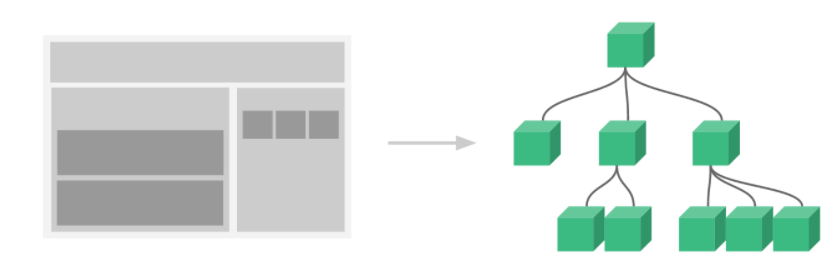
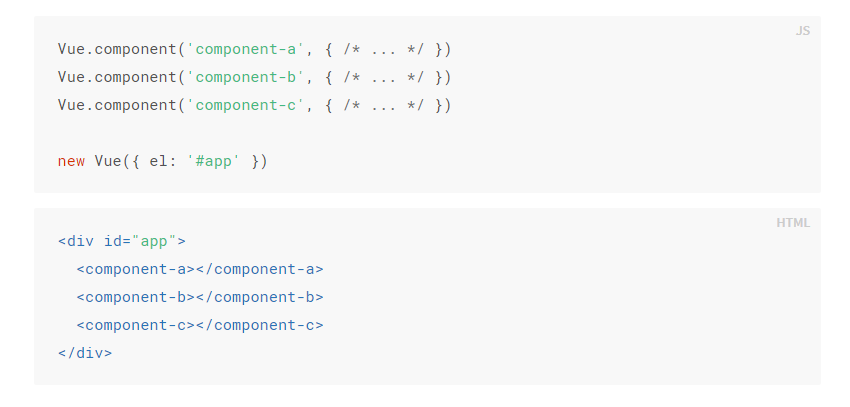

# vue

## vue实例

 每个 Vue 应用都是通过用 `Vue` 函数创建一个新的 **Vue 实例**开始的： 

```vue
var vm = new Vue({
  // 选项
})
// vm为vue.js对象
// el:element 元素属性
// data:数据变量
```

### 数据与方法

 当一个 Vue 实例被创建时，它将 `data` 对象中的所有的 property 加入到 Vue 的**响应式系统**中。当这些 property 的值发生改变时，视图将会产生“响应”，即匹配更新为新的值 

```vue
<!DOCTYPE html>
<!DOCTYPE html>
<html lang="en">
<head>
    <meta charset="UTF-8">
    <meta name="viewport" content="width=device-width, initial-scale=1.0">
    <script src="vue.js" type="text/javascript" charset="utf-8"></script>
    <title>Document</title>
</head>
<body>
    <div id="app">
        {{ a }}
    </div>
    <script type="text/javascript">
        var data = { a : 1};
        var vm = new Vue({
            el: "#app",
            data: data //此data非彼data
        });
        data.a = "hi .... new ..."  // 通过data改变值
        vm.a = "test";  // 与上等价
        // 获得这个实例上的 property
        // 返回源数据中对应的字段
        vm.a == data.a // => true
        // 此处另加值比如b不行，需要提前在new vue中声明（当这些数据改变时，视图会进行重渲染。值得注意的是只有当实例被创建时就已经存在于 data 中的 property 才是响应式的）
    </script>
</body>
</html>
```

```javascript
data: {
  newTodoText: '',
  visitCount: 0,
  hideCompletedTodos: false,
  todos: [],
  error: null
}
//针对上面未申明问题，可以提前设置初始值
```

唯一的例外是使用 `Object.freeze()`，这会阻止修改现有的 property，也意味着响应系统无法再*追踪*变化。 

```vue
<div id="app-1">
    <p> {{ b }}</p>
    <button v-on:click="b = 'change'">Change it</button>
</div>

<script type="text/javascript">
    var data = { b : 'bar'};
    Object.freeze(data)  // 此处注意需要放在放入new vue实例之前
    var vm = new Vue({
        el: "#app-1",
        data: data
    });

</script>
```

除了数据 property，Vue 实例还暴露了一些有用的实例 property 与方法。它们都有前缀 `$`，以便与用户定义的 property 区分开来 

```vue
<div id="example">
    {{ a }}
</div>
<script type="text/javascript">
    var data = { a : 1}
    var vm = new Vue({
        el: "#example",
        data: data
    })
    vm.$data === data // -> TRUE
    vm.$el === document.getElementById('example') // -> TRUE

    vm.$watch('a', function(newVal, oldVal){
        // 这个回调在vm.a改变后调用
        console.log(newVal, oldVal)
    })
    vm.$data.a = 2
</script>
```

> watch观察变化，返回观察前后结果
>
> 首先指定观察的变量，然后执行回调函数，含newval、oldval。会记录变量的变化，返回最新一次

实验中改变a的值效果如下：


### 实例生命周期钩子

 每个 Vue 实例在被创建时都要经过一系列的初始化过程——例如，需要设置数据监听、编译模板、将实例挂载到 DOM 并在数据变化时更新 DOM 等。同时在这个过程中也会运行一些叫做**生命周期钩子**的函数，这给了用户在不同阶段添加自己的代码的机会 

**写在new vue对象内，以属性的方式进行声明**

> api:
>
> https://cn.vuejs.org/v2/api/#%E9%80%89%E9%A1%B9-%E7%94%9F%E5%91%BD%E5%91%A8%E6%9C%9F%E9%92%A9%E5%AD%90

#### this

 生命周期钩子的 `this` 上下文指向调用它的 Vue 实例 

#### create

 比如 [`created`](https://cn.vuejs.org/v2/api/#created) 钩子可以用来在一个实例被**创建之后**执行代码： 

```vue
<script type="text/javascript">
    new Vue({
        data: {
            a: 1
        },
        created: function () {
            // `this` 指向 vm 实例
            console.log('a is: ' + this.a)
        }
    })
    // => "a is: 1" 
</script>
```

> 注意：
>
>  不要在选项 property 或回调上使用[箭头函数](https://developer.mozilla.org/zh-CN/docs/Web/JavaScript/Reference/Functions/Arrow_functions)，比如
>
>  `created: () => console.log(this.a)` 或
>
>  `vm.$watch('a', newValue => this.myMethod())`。
>
> 因为箭头函数并没有 `this`，`this` 会作为变量一直向上级词法作用域查找，直至找到为止，经常导致 `Uncaught TypeError: Cannot read property of undefined` 或 `Uncaught TypeError: this.myMethod is not a function` 之类的错误。 
>
>  所有的生命周期钩子自动绑定 `this` 上下文到实例中，因此你可以访问数据，对 property 和方法进行运算。这意味着**你不能使用箭头函数来定义一个生命周期方法** (例如 `created: () => this.fetchTodos()`)。这是因为箭头函数绑定了父上下文，因此 `this` 与你期待的 Vue 实例不同，`this.fetchTodos` 的行为未定义 

#### 生命周期图示

  

## 模板语法

### 插值

#### 文本

 数据绑定最常见的形式就是使用“Mustache”语法 (双大括号) 的文本插值。Mustache 标签将会被替代为对应数据对象上 `msg` property 的值。无论何时，绑定的数据对象上 `msg` property 发生了改变，插值处的内容都会更新。

通过使用 **v-once 指令**，你也能执行一次性地插值，当数据改变时，插值处的内容不会更新。但请留心这会影响到该节点上的其它数据绑定：

```vue
<span id="app" v-once>Message: {{ msg }}</span>
<script type="text/javascript">
    var data = { msg : 1}
    var vm = new Vue({
        el: "#app",
        data: data
    })
</script>
```

#### 原始HTML

 双大括号会将数据解释为普通文本，而非 HTML 代码。为了输出真正的 HTML，需要使用 `v-html` 指令

```vue
<p id="app-2">Using mustaches: {{ rawHtml }} </p>
<script type="text/javascript">
    var vm = new Vue({
        el: "#app-2",
        data:{
            rawHtml: '<span style="color : red">hello world</span>'
        }
    })
</script>
```

result：


```vue
<p id="app-2" v-html="rawHtml">Using v-html mustaches: {{ rawHtml }} </p>
<script type="text/javascript">
    var vm = new Vue({
        el: "#app-2",
        data:{
            rawHtml: '<span style="color : red">hello world</span>'
        }
    })
</script>
```

result：


> `span` 的内容将会被替换成为 property 值 `rawHtml`，直接作为 HTML——会忽略解析 property 值中的数据绑定。注意，你不能使用 `v-html` 来复合局部模板，因为 Vue 不是基于字符串的模板引擎。反之，对于用户界面 (UI)，组件更适合作为可重用和可组合的基本单位 

#### Attribute

```vue
<div id="app-3">
    <div v-bind:class="color">test..bind</div>
    <!-- v-bind:属性=".." -->
</div>
<script type="text/javascript">
    var vm = new Vue({
        el: "#app-3",
        data: {
            color: 'red'
        }
    })
</script>
<style type="text/css">
    .red{color: red; font-size: 100px;}
    /* font-size设置大小 */
</style>
```

result：


 Mustache 语法不能作用在 HTML attribute 上，遇到这种情况应该使用 `v-bind` 指令

 对于布尔 attribute (它们只要存在就意味着值为 `true`)，`v-bind` 工作起来略有不同

```vue
<button v-bind:disabled="isButtonDisabled">Button</button>
```

如果 `isButtonDisabled` 的值是 `null`、`undefined` 或 `false`，则 `disabled` attribute 甚至不会被包含在渲染出来的 `` 元素中 

#### JavaScript表达式


对于所有的数据绑定，Vue.js 都提供了完全的 JavaScript 表达式支持，使得不仅限于使用 简单的 property 键值 

```vue
<div id="javascript_study">
    <div> {{number + 1}} </div>
    <div> {{ ok ? 'YES' : 'NO'}} </div>
    <div> {{ message.split('').reverse().join('') }} </div>
</div>
<script type="text/javascript">
    var vm = new Vue({
        el: "#javascript_study",
        data:{
            number: 2,
            ok: 0,
            message: "vue"
        }
    })
</script>
```

result：

这些表达式会在所属 Vue 实例的数据作用域下作为 JavaScript 被解析。有个限制就是，每个绑定都只能包含**单个表达式**，否则**不会**生效 

```html
<!-- 这是语句，不是表达式 -->
{{ var a = 1 }}

<!-- 流控制也不会生效，请使用三元表达式 -->
{{ if (ok) { return message } }}
```

> 模板表达式都被放在沙盒中，只能访问[全局变量的一个白名单](https://github.com/vuejs/vue/blob/v2.6.10/src/core/instance/proxy.js#L9)，如 `Math` 和 `Date` 。你不应该在模板表达式中试图访问用户定义的全局变量 


### 指令

 指令 (Directives) 是带有 `v-` 前缀的特殊 attribute。指令 attribute 的值预期是**单个 JavaScript 表达式** (`v-for` 是例外情况)。指令的职责是，当表达式的值改变时，将其产生的连带影响，响应式地作用于 DOM 

如

```html
<p v-if="seen">现在你看到我了</p>
```

#### 参数

一些指令能接收一个参数，在指令名称之前:表示，如v-bind用于响应式更新html属性

```html
<a v-bind:href="url">...</a>
```

> href为参数，v-bind指令将该元素href属性与表达式url绑定

```html
<div id="app-1">
    <!-- v-on监听DOM事件，参数为监听事件名 -->
    <a v-on:click="doSomething">...</a>
</div>
<script>
    var vm = new Vue({
        el: "#app-1",
        methods:{
            doSomething: function() {
                console.log('click')
            }
        }
    })
</script>
```

> v-on监听事件
>
> 对于事件单击：click
>
> 对于鼠标事件：monseenter
>
> 对于双击事件：dbclick
>
> 触发事件执行方法，方法定义于methods中
>
> **v-on:click简写为:@click，其他亦然**

#### 动态参数

可用方括号括起来的 JavaScript 表达式作为一个指令的参数

```html
<!--
注意，参数表达式的写法存在一些约束，如之后的“对动态参数表达式的约束”章节所述。
-->
<a v-bind:[attributeName]="url"> ... </a>
```

 `attributeName` 会被作为一个 JavaScript 表达式进行动态求值，求得的值将会作为最终的参数来使用，如果Vue 实例有一个 `data` property `attributeName`，其值为 `"href"`，那么这个绑定将等价于 `v-bind:href` 

 可以**使用动态参数为一个动态的事件名绑定处理函数** 

```html
<a v-on:[eventName]="doSomething"> ... </a>
```

 当 `eventName` 的值为 `"focus"` 时，`v-on:[eventName]` 将等价于 `v-on:focus` 

##### 对动态参数的值的约束

 动态参数预期会求出一个字符串，异常情况下值为 `null`。这个特殊的 `null` 值可以被显性地用于移除绑定。任何其它非字符串类型的值都将会触发一个警告 


##### 对动态参数表达式的约束

- 动态参数表达式有一些语法约束，因为某些字符，如空格和引号，放在 HTML attribute 名里是无效的 
- 在 DOM 中使用模板时 (直接在一个 HTML 文件里撰写模板)，还需要避免使用大写字符来命名键名，因为浏览器会把 attribute 名全部强制转为小写 


#### 修饰符

 修饰符 (modifier) 是以半角句号 `.` 指明的特殊后缀，用于指出一个指令应该以特殊方式绑定。例如，`.prevent` 修饰符告诉 `v-on` 指令对于触发的事件调用 `event.preventDefault()` 

```html
<form v-on:submit.prevent="onSubmit">...</form>
```


### 缩写

 `v-` 前缀作为一种视觉提示，用来识别模板中 Vue 特定的 attribute。当你在使用 Vue.js 为现有标签添加动态行为 (dynamic behavior) 时，`v-` 前缀很有帮助，然而，对于一些频繁用到的指令来说，就会感到使用繁琐。因此，Vue 为 `v-bind` 和 `v-on` 这两个最常用的指令，提供了特定简写 

#### v-bind

```html
<!-- 完整语法 -->
<a v-bind:href="url">...</a>

<!-- 缩写 -->
<a :href="url">...</a>

<!-- 动态参数的缩写 (2.6.0+) -->
<a :[key]="url"> ... </a>
```


#### v-on

```html
<!-- 完整语法 -->
<a v-on:click="doSomething">...</a>

<!-- 缩写 -->
<a @click="doSomething">...</a>

<!-- 动态参数的缩写 (2.6.0+) -->
<a @[event]="doSomething"> ... </a>
```

>  `:` 与 `@` 对于 attribute 名来说都是合法字符，在所有支持 Vue 的浏览器都能被正确地解析。而且，它们不会出现在最终渲染的标记中。缩写语法是完全可选的 


## 计算属性和侦听器

> 对于一些复杂逻辑，考虑使用计算属性

如下式子过于复杂

```vue
<div id="example">
  {{ message.split('').reverse().join('') }}
</div>
```

使用计算属性后：

```vue
<div id="app-1">
    <p>Orignal message: "{{ message }}"</p>
    <p>Computed reversed message: "{{ reversedMessage}}"</p>
</div>
<script>
    var vm = new Vue({
        el: "#app-1",
        data: {
            message: "Hello"
        },
        computed: {
            // 计算属性的 getter
            reversedMessage: function () {
                // this 指向vm实例
                return this.message.split('').reverse().join('')
            }
        }
    })
</script>
```

> 此处声明了计算属性 **reversedMessage**。提供的函数将作为 property **vm.reversedMessage** 的 **getter** 函数

result：


>  `vm.reversedMessage` 的值始终取决于 `vm.message` 的值

### 计算属性缓存和方法

有时可以通过在表达式中调用方法来达到上面效果

```vue
<p>Reversed message: "{{ reversedMessage() }}"</p>
<script>
    var vm = new Vue({
        el: "#app-1",
        data: {
            message: "Hello"
        },
        methods: {
            reversedMessage: function() {
                return this.message.split('').reverse().join('')
            }
        }
    })
</script>
```

>  **计算属性是基于它们的响应式依赖进行缓存的**。只在相关响应式依赖发生改变时它们才会重新求值。这就意味着只要 `message` 还没有发生改变，多次访问 `reversedMessage` 计算属性会立即返回之前的计算结果，而不必再次执行函数 

注意： 如果没有缓存，我们将不可避免的多次执行 **A** 的 getter 


### 计算属性和侦听属性

> Vue 提供了一种更通用的方式来观察和响应 Vue 实例上的数据变动：**侦听属性**。当有一些数据需要随着其它数据变动而变动时，很容易滥用 `watch`。然而，通常更好的做法是使用计算属性而不是命令式的 `watch` 回调 

watch回调使用如下：

```vue
<p>{{ fullName }}</p>
<script>
    var vm = new Vue({
        el: "#app-1",
        data: {
            firstName: "Foo",
            lastName: "Bar",
            fullName: "Foo Bar"
        },
        watch: {
            // 监听firstName值
            firstName: function (val) {
                this.fullName = val + ' ' + this.lastName
            },
            lastName: function (val) {
                this.fullName = this.firstName + ' ' + val
            }
        }
    })
</script>
```

result：


当将firstname改为TEST结果如下：


>  上面代码是命令式且重复的，使用计算属性更加简单


### 计算属性的setter

>  计算属性默认只有 getter，不过在需要时也可以提供一个 setter 

```vue
<div id="app-2">
    <p> {{ fullName }} </p>
</div>
<script type="text/javascript">
    var vm = new Vue({
        el: "#app-2",
        data: {
            firstName: "Foo",
            lastName: "voo"
        },
        computed: {
            fullName: {
                // getter
                get: function () {
                    return this.firstName + ' ' + this.lastName
                },
                // setter
                set: function (newValue) {
                    var names = newValue.split(' ')
                    this.firstName = names[0]
                    this.lastName = names[names.length - 1]
                }
            }
        }
    })
</script>
```

result:


运行vm.fullName=‘John Doe’ 调用setter，同时firstname和lastname也改变


### 侦听器

> 虽然计算属性在大多数情况下更合适，但有时也需要一个自定义的侦听器。这就是为什么 Vue 通过 `watch` 选项提供了一个更通用的方法，来响应数据的变化。当需要在数据变化时执行异步或开销较大的操作时，这个方式是最有用的 

```vue
<div id="app-3">
    <p>
        Ask a yes/no question:
        <input v-model="question">
    </p>
    <p>{{ answer }}</p>
</div>
<!-- 因为 AJAX 库和通用工具的生态已经相当丰富，Vue 核心代码没有重复 -->
<!-- 提供这些功能以保持精简。这也可以让你自由选择自己更熟悉的工具。 -->
<script src="https://cdn.jsdelivr.net/npm/axios@0.12.0/dist/axios.min.js"></script>
<script src="https://cdn.jsdelivr.net/npm/lodash@4.13.1/lodash.min.js"></script>
<script>
    var watchExampleVM = new Vue({
        el: "#app-3",
        data: {
            question: '',
            answer: 'I cannot give you an answer until you ask a question!'
        },
        watch: {
            // 如果 `question` 发生改变，这个函数就会运行
            question: function (newQuestion, oldQuestion) {
                this.answer = 'Waiting for you to stop typing...'
                this.debouncedGetAnswer()
            }
        },
        created: function () {
            // `_.debounce` 是一个通过 Lodash 限制操作频率的函数。
            // 在这个例子中，我们希望限制访问 yesno.wtf/api 的频率
            // AJAX 请求直到用户输入完毕才会发出。想要了解更多关于
            // `_.debounce` 函数 (及其近亲 `_.throttle`) 的知识，
            // 请参考：https://lodash.com/docs#debounce
            this.debouncedGetAnswer = _.debounce(this.getAnswer, 500)
        },
        methods: {
            getAnswer: function () {
                if (this.question.indexOf('?') === -1) {
                    this.answer = 'Questions usually contain a question mark. ;-)'
                    return
                }
                this.answer = 'Thinking...'
                var vm = this
                axios.get('https://yesno.wtf/api')
                    .then(function (response) {
                    vm.answer = _.capitalize(response.data.answer)
                })
                    .catch(function (error) {
                    vm.answer = 'Error! Could not reach the API. ' + error
                })
            }
        }
    })
</script>
```

> 在这个示例中，使用 `watch` 选项允许执行异步操作 (访问一个 API)，限制执行该操作的频率，并在得到最终结果前，设置中间状态。这些都是计算属性无法做到的 

## Class与Style绑定

> 操作元素的 class 列表和内联样式是数据绑定的一个常见需求。因为它们都是 attribute，所以我们可以用 `v-bind` 处理它们：只需要通过表达式计算出字符串结果即可。不过，字符串拼接麻烦且易错。因此，在将 `v-bind` 用于 `class` 和 `style` 时，Vue.js 做了专门的增强。表达式结果的类型除了字符串之外，还可以是对象或数组 

### 绑定HTML Class

#### 对象语法

1. 

   > - 可以传给 `v-bind:class` 一个对象，以动态地切换 class 
   >
   > - `active` 这个 class 存在与否将取决于数据 property `isActive` 的 truthiness
   >
   > - 可以在对象中传入更多字段来动态切换多个 class。此外，`v-bind:class` 指令也可以与普通的 class attribute 共存 

   ```vue
   <div id="app-1">
       <div class="static" v-bind:class="{ active: isActive, 'text-danger': hasError }"></div>
   </div>
   <script type="text/javascript">
       var vm = new Vue({
           el: "#app-1",
           data: {
               isActive: true,
               hasError: false
           }
       })
   </script>
   ```

   result:

   

2. 此外，绑定的数据对象不必内联定义在模板里：

   ```vue
   <div id="app-2">
       <div v-bind:class="classObject"></div>
   </div>
   <script type="text/javascript">
       var vm = new Vue({
           el: "#app-2",
           data: {
               classObject: {
                   active: true,
                   'text-danger': false
               }
           }
       })
   </script>
   ```

3.  也可以在这里绑定一个返回对象的**计算属性**

   ```vue
   <div id="app-3">
       <div v-bind:class="classObject"></div>
   </div>
   <script type="text/javascript">
       var vm = new Vue({
           el: "#app-3",
           data: {
               isActive: true,
               error: null
           },
           computed: {
               classObject: function () {
                   return {
                       active: this.isActive && !this.error,
                       'text-danger': this.error && this.error.type === 'fatal'
                   }
               }
           }
       })
   </script>
   ```

   

#### 数组语法

- 可以把一个数组传给 `v-bind:class`，以应用一个 class 列表 

```vue
<div id="app-4">
    <div v-bind:class="[activeClass, errorClass]"></div>
</div>
<script type="text/javascript">
    var vm = new Vue({
        el: "#app-4",
        data: {
            activeClass: 'active',
            errorClass: 'text-danger'
        }
    })
</script>
```

- 根据条件切换列表中的 class，可以用三元表达式 

```vue
<div id="app-4">
    <div v-bind:class="[isActive ? activeClass : '', errorClass]"></div>
</div>
<script type="text/javascript">
    var vm = new Vue({
        el: "#app-4",
        data: {
            activeClass: 'active',
            errorClass: 'text-danger',
            isActive: true
        }
    })
</script>
```

- 当有多个条件 class 时这样写有些繁琐。所以在数组语法中也可以使用对象语法 

```vue
<div v-bind:class="[{ active: isActive }, errorClass]"></div>
```


#### 用在组件上###################

https://cn.vuejs.org/v2/guide/class-and-style.html#%E7%94%A8%E5%9C%A8%E7%BB%84%E4%BB%B6%E4%B8%8A

### 绑定内联样式style

#### 对象语法

> `v-bind:style` 的对象语法十分直观——看着非常像 CSS，但其实是一个 JavaScript 对象 

```vue
<div id="app-5">
    <div v-bind:style="{ color: activeColor, fontSize: fontSize + 'px'}">123</div>
</div>
<script type="text/javascript">
    var vm = new Vue({
        el: "#app-5",
        data: {
            activeColor: 'red',
            fontSize: 30
        }
    })
</script>
```

> 直接绑定到一个样式对象通常更好，这会让模板更清晰 

```vue
<div id="app-5">
    <div v-bind:style="styleObject">123</div>
</div>
<script type="text/javascript">
    var vm = new Vue({
        el: "#app-5",
        data: {
            activeColor: 'red',
            fontSize: 30,
            styleObject: {
                color: 'red',
                fontSize: '13px'
            }
        }
    })
</script>
```


#### 数组语法

> `v-bind:style` 的数组语法可以将多个样式对象应用到同一个元素上 

```vue
<div v-bind:style="[baseStyles, overridingStyles]"></div>
```


#### 自动添加前缀#################

> 当 `v-bind:style` 使用需要添加[浏览器引擎前缀](https://developer.mozilla.org/zh-CN/docs/Glossary/Vendor_Prefix)的 CSS property 时，如 `transform`，Vue.js 会自动侦测并添加相应的前缀 

#### 多重值

> 可以为 `style` 绑定中的 property 提供一个包含多个值的数组，常用于提供多个带前缀的值 

如下：

```html
<div :style="{ display: ['-webkit-box', '-ms-flexbox', 'flex'] }"></div>
```

> 这样写只会渲染数组中***最后一个*被浏览器支持的值**。在本例中，如果浏览器支持不带浏览器前缀的 flexbox，那么就只会渲染 `display: flex` 


## 条件渲染

### v-if

> `v-if` 指令用于条件性地渲染一块内容。这块内容只会在指令的表达式返回 truthy 值的时候被渲染

```vue
<div id="app-1">
    <h1 v-if="awesome">AWESOME</h1>
    <h1 v-else> Oh no </h1>
</div>
<script type="text/javascript">
    var vm = new Vue({
        el: "#app-1",
        data: {
            awesome: true
        }
    })
</script>
```

> `v-else` 元素必须紧跟在带 `v-if` 或者 `v-else-if` 的元素的后面，否则它将不会被识别 
>
>  类似于 `v-else`，`v-else-if` 也必须紧跟在带 `v-if` 或者 `v-else-if` 的元素之后 

### 在template元素上使用 v-if 条件渲染分组

> 因为 `v-if` 是一个指令，所以必须将它添加到一个元素上。但是如果想切换多个元素呢？此时可以把一个template元素当做不可见的包裹元素，并在上面使用 v-if。最终的渲染结果将不包含 template 元素 

```vue
<template v-if="ok">
  <h1>Title</h1>
  <p>Paragraph 1</p>
  <p>Paragraph 2</p>
</template>
```

### 用 `key` 管理可复用的元素

> Vue 会尽可能高效地渲染元素，通常会**复用已有元素而不是从头开始渲染**。这么做除了使 Vue 变得非常快之外，还有其它一些好处。例如，如果允许用户在不同的登录方式之间切换 

```vue
<div id="app-2">
    <template v-if="loginType === 'username'">
<label>Username</label>
<input placeholder="Enter your username">
    </template>
    <template v-else>
<label>Email</label>
<input placeholder="Enter your email address">
    </template>
    <button v-on:click="change">{{ content }}</button>
</div>
<script type="text/javascript">
    var vm = new Vue({
        el: "#app-2",
        data:{
            loginType: "username",
            content: "use email"
        },
        methods:{
            change: function () {
                if (this.loginType == "username"){
                    this.loginType = "email"
                    this.content = "use username"
                }else{
                    this.loginType = "username"
                    this.content = "use email"
                }
            }
        }
    })
</script>
```

> 在上面的代码中切换 `loginType` 将不会清除用户已经输入的内容。因为两个模板使用了相同的元素，`<input>` 不会被替换掉——仅仅是替换了它的 `placeholder` 
>
> 当然，如果不需要复用，  Vue 为提供了一种方式来表达“这两个元素是完全独立的，不要复用它们”。只需添加一个具有唯一值的 `key` attribute 即可 

```vue
<div id="app-2">
    <template v-if="loginType === 'username'">
<label>Username</label>
<input placeholder="Enter your username" key="username-input">
    </template>
    <template v-else>
<label>Email</label>
<input placeholder="Enter your email address" key="email-input">
    </template>
    <button v-on:click="change">{{ content }}</button>
</div>
<script type="text/javascript">
    var vm = new Vue({
        el: "#app-2",
        data:{
            loginType: "username",
            content: "use email"
        },
        methods:{
            change: function () {
                if (this.loginType == "username"){
                    this.loginType = "email"
                    this.content = "use username"
                }else{
                    this.loginType = "username"
                    this.content = "use email"
                }
            }
        }
    })
</script>
```

> `<label>` 元素仍然会被高效地复用，因为它们没有添加 `key` attribute 


### v-show

根据表达值真假，切换元素的显示和隐藏

> 带有 `v-show` 的元素始终会被渲染并保留在 DOM 中。`v-show` 只是简单地切换元素的 CSS property `display` 
>
>  `v-show` 不支持 `<template>` 元素，也不支持 `<v-else>` 

```vue
<h1 v-show="ok">Hello!</h1>
```

result:


> 也可以是" "中写表达式，如age<10

### v-if & v-show

> 操纵dom元素

`v-if` 是“真正”的条件渲染，因为它会确保在切换过程中条件块内的事件监听器和子组件适当地被销毁和重建。

`v-if` 也是**惰性的**：如果在初始渲染时条件为假，则什么也不做——直到条件第一次变为真时，才会开始渲染条件块。

相比之下，`v-show` 就简单得多——不管初始条件是什么，元素总是会被渲染，并且只是简单地基于 CSS 进行切换。

一般来说，**`v-if` 有更高的切换开销，而 `v-show` 有更高的初始渲染开销**。因此，如果需要非常频繁地切换，则使用 `v-show` 较好；如果在运行时条件很少改变，则使用 `v-if` 较好

### v-if与v-for

 当 `v-if` 与 `v-for` 一起使用时，`v-for` 具有比 `v-if` 更高的优先级 , **不推荐**同时使用 `v-if` 和 `v-for` 

https://cn.vuejs.org/v2/style-guide/#%E9%81%BF%E5%85%8D-v-if-%E5%92%8C-v-for-%E7%94%A8%E5%9C%A8%E4%B8%80%E8%B5%B7%E5%BF%85%E8%A6%81

## 列表渲染

### 用 `v-for` 把一个数组对应为一组元素

> 可以用 `v-for` 指令基于一个**数组([ ..... ])**来渲染一个列表。`v-for` 指令需要使用 `item in items` 形式的特殊语法，其中 `items` 是源数据数组，而 `item` 则是被迭代的数组元素的**别名** 
>
>  在 `v-for` 块中，可以访问所有父作用域的 property 

```vue
<div id="app-1">
    <ul id="example-1">
        <li v-for="item in items" :key="item.message">
            {{ item.message }}
        </li>
    </ul>
</div>
<script type="text/javascript">
    var vm = new Vue({
        el: "#example-1",
        data: {
            items:[
                {message: 'Foo'},
                {message: 'Bar'}
            ]
        }
    })
</script>
```

> `v-for` 还支持一个可选的第二个参数，即当前项的索引

```vue
<ul id="example-1">
    <li v-for="(item, idx) in items" :key="item.message">
        {{ item.message }} - {{ idx }}
    </li>
</ul>
```

注： 也可以用 `of` 替代 `in` 作为分隔符，因为它更接近 JavaScript 迭代器的语法 


### 在 `v-for` 里使用对象

> 可以用 `v-for` 来遍历一个**对象({....})**的 property 

```vue
<ul id="v-for-object" class="demo">
    <li v-for="value of object">
        {{ value }}
    </li>
</ul>
<script type="text/javascript">
    var vm_2 = new Vue({
        el: "#v-for-object",
        data: {
            object: {
                title: "how to do",
                author: "jane",
                publishedAt: "2016-04-10"
            }
        }
    })
</script>
```

> 若存在第二个参数，则为键名即v-for="(value, key) in object"
>
> 若存在第三个参数，则为索引即v-for="(value, key, idx) in object"

在遍历对象时，会按 `Object.keys()` 的结果遍历，但是**不能**保证它的结果在不同的 JavaScript 引擎下都一致。


### 维护状态

> 当 Vue 正在更新使用 `v-for` 渲染的元素列表时，它默认使用“就地更新”的策略。如果数据项的顺序被改变，Vue 将不会移动 DOM 元素来匹配数据项的顺序，而是就地更新每个元素，并且确保它们在每个索引位置正确渲染。 
>
> 这个默认的模式是高效的，但是**只适用于不依赖子组件状态或临时 DOM 状态 (例如：表单输入值) 的列表渲染输出**。
>
> 为了给 Vue 一个提示，以便它能跟踪每个节点的身份，从而重用和重新排序现有元素，需要为每项提供一个唯一 `key` attribute：
>
> ```vue
> <div v-for="item in items" v-bind:key="item.id">   
>     <!-- 内容 --> 
> </div>
> ```
>
> **不要使用对象或数组之类的非基本类型值作为 `v-for` 的 `key`。请用字符串或数值类型的值** ?


### 数组更新检测

#### 变更方法

>Vue 将被侦听的数组的变更方法进行了包裹，所以它们也将会触发视图更新。这些被包裹过的方法包括：

- `push()`
- `pop()`
- `shift()`
- `unshift()`
- `splice()`
- `sort()`
- `reverse()`

> 打开控制台，然后对前面例子的 `items` 数组尝试调用变更方法。比如 `example1.items.push({ message: 'Baz' })`,视图会更新

 变更方法，顾名思义，会变更调用了这些方法的原始数组 

#### 替换数组

 `filter()`、`concat()` 和 `slice()`。它们不会变更原始数组，而**总是返回一个新数组**。当使用非变更方法时，可以用新数组替换旧数组 

```js
vm.items = vm.items.filter(function(item){return item.message.match(/Foo/)})
```

> 可能认为这将导致 Vue 丢弃现有 DOM 并重新渲染整个列表。幸运的是，事实并非如此。Vue 为了使得 DOM 元素得到最大范围的重用而实现了一些智能的启发式方法，所以用一个含有相同元素的数组去替换原来的数组是非常高效的操作。 

注：由于 JavaScript 的限制，Vue **不能检测**数组和对象的变化 


### 显示过滤/排序后的结果

> 显示一个数组经过过滤或排序后的版本，而不实际变更或重置原始数据。在这种情况下，可以创建一个计算属性，来返回过滤或排序后的数组 

```vue
</script>
<ul id="filter">
    <li v-for="n in evenNumbers">{{ n }}</li>
</ul>
<script type="text/javascript">
    var vm = new Vue({
        el: "#filter",
        data: {
            numbers: [1, 2, 3, 4, 5]
        },
        computed: {
            evenNumbers: function() {
                return this.numbers.filter(function(number){
                    return number%2 === 0
                })
            }
        }
    })
</script>
```

在计算属性不适用的情况下 (例如，在嵌套 `v-for` 循环中) 可以使用一个**方法** 

```vue
<div id="qiantao">
    <ul v-for="set in sets">
        <li v-for="n in even(set)">{{ n }}</li>
    </ul>
</div>
<script type="text/javascript">
    var vm = new Vue({
        el: "#qiantao",
        data: {
            sets: [[1, 2, 3, 4, 5], [6, 7, 8, 9, 10]]
        },
        //////////////////////
        methods: {
            even: function (numbers) {
                return numbers.filter(function (number) {
                    return number % 2 === 0
                })
            }
        }
    })
</script>
```


### 在 `v-for` 里使用值范围

`v-for` 也可以接受整数。在这种情况下，它会把模板重复对应次数。

```html
<div>
  <span v-for="n in 10">{{ n }} </span>
</div>
```


### 在`<template>`上使用v-for

类似于 `v-if`，也可以利用带有 `v-for` 的 `<template>`来循环渲染一段包含多个元素的内容。比如：

```html
<ul>
  <template v-for="item in items">
    <li>{{ item.msg }}</li>
    <li class="divider" role="presentation"></li>
  </template>
</ul>
```


### v-for与v-if

 **不**推荐在**同一元素**上使用 `v-if` 和 `v-for` 

> 当它们处于**同一节点**，`v-for` 的优先级比 `v-if` 更高，这意味着 `v-if` 将分别重复运行于每个 `v-for` 循环中。当只想为*部分*项渲染节点时，这种优先级的机制会十分有用 

```html
<li v-for="todo in todos" v-if="!todo.isComplete">
  {{ todo }}
</li>
```

**上面的代码将只渲染未完成的 todo**

而目的是有条件地跳过循环的执行，那么可以将 `v-if` 置于外层元素 (或 `<template>`) 上。如：

```html
<ul v-if="todos.length">
  <li v-for="todo in todos">
    {{ todo }}
  </li>
</ul>
<p v-else>No todos left!</p>
```


### 在组件上使用v-for######################################

## 事件处理

### 监听事件

 用 `v-on` 指令监听 DOM 事件，并在触发时运行一些 JavaScript 代码 

```vue
<div id="example-1">
    <button v-on:click="counter += 1">Add 1</button>
    <p>The button above has been clicked {{ counter }} times.</p>
</div>
<script type="text/javascript">
    var example1 = new Vue({
        el: '#example-1',
        data: {
            counter: 0
        }
    })
</script>
```


### 事件处理方法

> 许多事件处理逻辑会更为复杂，所以直接把 JavaScript 代码写在 `v-on` 指令中是不可行的。因此 `v-on` 还可以接收一个需要调用的方法名称 

```vue
<div id="example-2">
    <!-- `greet` 是在下面定义的方法名 -->
    <button v-on:click="greet">Greet</button>
</div>
<script type="text/javascript">
    var example2 = new Vue({
        el: '#example-2',
        data: {
            name: 'Vue.js'
        },
        // 在 `methods` 对象中定义方法
        methods: {
            greet: function (event) {
                // `this` 在方法里指向当前 Vue 实例
                alert('Hello ' + this.name + '!')
                // `event` 是原生 DOM 事件
                if (event) {
                    alert(event.target.tagName + " yes")
                }
            }
        }
    })

    // 也可以用 JavaScript 直接调用方法 此时event为false
    example2.greet() // => 'Hello Vue.js!'
</script>
```


### 内联处理器中的方法

> 除了绑定方法，也可以在内联javascript语句中直接调用

```vue
<div id="example-3">
    <button v-on:click="say('hi')">Say hi</button>
    <button v-on:click="say('what')">Say what</button>
</div>
<script type="text/javascript">
    new Vue({
        el: '#example-3',
        methods: {
            say: function (message) {
                alert(message)
            }
        }
    })
</script>
```

 ?有时也需要在内联语句处理器中访问原始的 DOM 事件。可以用特殊变量 `$event` 把它传入方法： 

```html
<button v-on:click="warn('Form cannot be submitted yet.', $event)">
  Submit
</button>
```

```js
// ...
methods: {
  warn: function (message, event) {
    // 现在我们可以访问原生事件对象
    if (event) {
      event.preventDefault()
    }
    alert(message)
  }
}
```


### 事件修饰符

 更好的方式是：方法只有纯粹的数据逻辑，而不是去处理 DOM 事件细节。 

> Vue.js 为 `v-on` 提供了**事件修饰符**。修饰符是由点开头的指令后缀来表示的 

- `.stop`
- `.prevent`
- `.capture`
- `.self`
- `.once`
- `.passive`

```vue
<!-- 阻止单击事件继续传播 -->
<a v-on:click.stop="doThis"></a>

<!-- 提交事件不再重载页面 -->
<form v-on:submit.prevent="onSubmit"></form>

<!-- 修饰符可以串联 -->
<a v-on:click.stop.prevent="doThat"></a>

<!-- 只有修饰符 -->
<form v-on:submit.prevent></form>

<!-- 添加事件监听器时使用事件捕获模式 -->
<!-- 即内部元素触发的事件先在此处理，然后才交由内部元素进行处理 -->
<div v-on:click.capture="doThis">...</div>

<!-- 只当在 event.target 是当前元素自身时触发处理函数 -->
<!-- 即事件不是从内部元素触发的 -->
<div v-on:click.self="doThat">...</div>
```

> 使用修饰符时，顺序很重要；相应的代码会以同样的顺序产生。因此，用 `v-on:click.prevent.self` 会阻止**所有的点击**，而 `v-on:click.self.prevent` 只会阻止对元素自身的点击。 

#### 新增###########################3

### 按键修饰符

> 在监听键盘事件时，经常需要检查详细的按键。Vue 允许为 `v-on` 在监听键盘事件时添加按键修饰符： 

```html
<!-- 只有在 `key` 是 `Enter` 时调用 `vm.submit()` -->
<input v-on:keyup.enter="submit">
```

 可以直接将 `KeyboardEvent.key` 暴露的任意有效按键名转换为 kebab-case 来作为修饰符 

```html
<!-- 处理函数只会在 $event.key 等于 PageDown 时被调用 -->
<input v-on:keyup.page-down="onPageDown">
```


#### 按键码

 `keyCode` 的事件用法已经废弃了并可能不会被最新的浏览器支持。 

 使用 `keyCode` attribute 也是允许的 ：

```html
<input v-on:keyup.13="submit">
```

 为了在必要的情况下支持旧浏览器，Vue 提供了绝大多数常用的按键码的别名： 

- `.enter`
- `.tab`
- `.delete` (捕获“删除”和“退格”键)
- `.esc`
- `.space`
- `.up`
- `.down`
- `.left`
- `.right`

> 可以通过全局 `config.keyCodes` 对象自定义按键修饰符别名 

```js
// 可以使用 `v-on:keyup.f1`
Vue.config.keyCodes.f1 = 112
```


### 系统修饰符

 可以用如下修饰符来实现仅在按下相应按键时才触发鼠标或键盘事件的监听器

- `.ctrl`
- `.alt`
- `.shift`
- `.meta`

```html
<!-- Alt + C -->
<input v-on:keyup.alt.67="clear">

<!-- Ctrl + Click -->
<div v-on:click.ctrl="doSomething">Do something</div>
```


#### .exact修饰符

 `.exact` 修饰符允许控制由精确的系统修饰符组合触发的事件 

```html
<!-- 即使 Alt 或 Shift 被一同按下时也会触发 -->
<button v-on:click.ctrl="onClick">A</button>

<!-- 有且只有 Ctrl 被按下的时候才触发 -->
<button v-on:click.ctrl.exact="onCtrlClick">A</button>

<!-- 没有任何系统修饰符被按下的时候才触发 -->
<button v-on:click.exact="onClick">A</button>
```


#### 鼠标按钮修饰符

- `.left`
- `.right`
- `.middle`

 这些修饰符会限制处理函数仅响应特定的鼠标按钮


### HTML中监听事件

 所有的 Vue.js 事件处理方法和表达式都严格绑定在当前视图的 ViewModel 上，它不会导致任何维护上的困难。实际上，使用 `v-on` 有几个好处： 

1. 扫一眼 HTML 模板便能轻松定位在 JavaScript 代码里对应的方法。
2. 因为无须在 JavaScript 里手动绑定事件， ViewModel 代码可以是非常纯粹的逻辑，和 DOM 完全解耦，更易于测试。
3. 当一个 ViewModel 被销毁时，所有的事件处理器都会自动被删除。无须担心如何清理它们。

## 表单输入绑定

### 基础用法

可以用 `v-model` 指令在表单 `<input>` 及 `<textarea>` `<select>` 元素上创建双向数据绑定。它会根据控件类型自动选取正确的方法来更新元素。 `v-model` 本质上不过是语法糖。它负责监听用户的输入事件以更新数据，并对一些极端场景进行一些特殊处理。

`v-model` 会忽略所有表单元素的 `value`、`checked`、`selected` attribute 的初始值而总是将 Vue 实例的数据作为数据来源。应该通过 JavaScript 在组件的 `data` 选项中声明初始值。

`v-model` 在内部为不同的输入元素使用不同的 property 并抛出不同的事件：

- text 和 textarea 元素使用 `value` property 和 `input` 事件；
- checkbox 和 radio 使用 `checked` property 和 `change` 事件；
- select 字段将 `value` 作为 prop 并将 `change` 作为事件。

对于需要使用输入法(如中文、日文、韩文等) 的语言， `v-model` 不会在输入法组合文字过程中得到更新。如果需要处理这个过程，可以使用 `input` 事件。

> **双向数据绑定**

#### 文本

```vue
<div id="example-1">
    <input v-model="message" placeholder="edit me">
    <p>Message is: {{ message }}</p>
</div>
<script type="text/javascript">
    var vm = new Vue({
        el: "#example-1",
        data: {
            message: ""
        }
    })
</script>
```

#### 多行文本

```vue
<span>Multiline message is:</span>
<p style="white-space: pre-line;">{{ message }}</p>
<br>
<textarea v-model="message" placeholder="add multiple lines"></textarea>
```

> 同样需要在js中初始化message


#### 复选框

```vue
<div id="example-2">
    <input type="checkbox" id="checkbox" v-model="checked">
    <label for="checkbox">{{ checked }}</label>
</div>
<script type="text/javascript">
    var vm = new Vue({
        el: "#example-2",
        data: {
            checked: true
        }
    })
</script>
```


> **多个复选框**，绑定到同一个数组： 

```vue
<div id="example-3">
    <input type="checkbox" id="jack" value="Jack" v-model="checkedNames">
    <label for="jack">Jack</label>
    <input type="checkbox" id="john" value="John" v-model="checkedNames">
    <label for="john">John</label>
    <input type="checkbox" id="mike" value="Mike" v-model="checkedNames">
    <label for="mike">Mike</label>
    <br>
    <span>Checked names: {{ checkedNames }}</span>
</div>
<script type="text/javascript">
    var vm = new Vue({
        el: "#example-3",
        data: {
            checkedNames: []
        }
    })
</script>
```

> value为加入数组的值


#### 单选按钮

```vue
<div id="example-4">
    <input type="radio" id="one" value="One" v-model="picked">
    <label for="one">One</label>
    <br>
    <input type="radio" id="two" value="Two" v-model="picked">
    <label for="two">Two</label>
    <br>
    <span>Picked: {{ picked }}</span>
</div>
<script type="text/javascript">
    var vm = new Vue({
        el: "#example-4",
        data: {
            picked: ''
        }
    })
</script>
```

> value为picked的值


#### 选择框

##### 单选：

```vue
<div id="example-5">
    <select v-model="selected">
        <option disabled value="">请选择</option>
        <option>A</option>
        <option>B</option>
        <option>C</option>
    </select>
    <span>Selected: {{ selected }}</span>
</div>
<script type="text/javascript">
    var vm = new Vue({
        el: "#example-5",
        data: {
            selected: ''
        }
    })
</script>
```

> 如果 `v-model` 表达式的初始值未能匹配任何选项，`<select>` 元素将被渲染为“未选中”状态。在 iOS 中，这会使用户无法选择第一个选项。因为这样的情况下，iOS 不会触发 change 事件。因此，更推荐像上面这样提供一个值为空的禁用选项。 

##### 多选时绑定至一个数组：

```vue
<div id="example-6">
    <select v-model="selected" multiple style="width: 50px;">
        <option>A</option>
        <option>B</option>
        <option>C</option>
    </select>
    <br>
    <span>Selected: {{ selected }}</span>
</div>
<script type="text/javascript">
    var vm = new Vue({
        el: "#example-6",
        data: {
            selected: []
        }
    })
</script>
```

 用 `v-for` 渲染的动态选项：

```vue
<div id="example-7">
    <select v-model="selected">
        <option v-for="option in options" v-bind:value="option.value">
            {{ option.text }}
        </option>
    </select>
    <span>Selected: {{ selected }}</span>
</div>
<script type="text/javascript">
    var vm = new Vue({
        el: "#example-7",
        data: {
            selected: 'A',
            options: [
                {text: 'One', value: 'A'},
                {text: 'Two', value: 'B'},
                {text: 'Three', value: 'C'}
            ]
        }
    })
</script>
```


### 值绑定

 对于单选按钮，复选框及选择框的选项，`v-model` 绑定的值通常是静态字符串 (对于复选框也可以是布尔值)， 但是有时可能想把值绑定到 Vue 实例的一个动态 property 上，这时可以用 `v-bind` 实现，并且这个 property 的值可以不是字符串。 

> v-bind设置元素属性

#### 复选框

```vue
<div id="example-8">
    <input type="checkbox" v-model="toggle" true-value="yes" false-value="no">
</div>
<script type="text/javascript">
    var vm = new Vue({
        el: "#example-8",
        data: {
            toggle: 'yes'
        }
    })
</script>
```

> // 当选中时 
>
> vm.toggle === 'yes' 
>
> // 当没有选中时 
>
> vm.toggle === 'no 

这里的 `true-value` 和 `false-value` attribute 并不会影响输入控件的 `value` attribute，因为浏览器在提交表单时并不会包含未被选中的复选框。如果要确保表单中这两个值中的一个能够被提交，(即“yes”或“no”)，请换用单选按钮。


#### 单选按钮

```vue
<div id="example-8">
    <input type="radio" v-model="pick" v-bind:value="a">
</div>
<script type="text/javascript">
    var vm = new Vue({
        el: "#example-8",
        data: {
            a: "12",
            pick: ""
        }
    })
</script>
```

```js
// 当选中时
vm.pick === vm.a
```


#### 选择框选项

```vue
<div id="example-8">
    <select v-model="selected">
        <!-- 内联对象字面量 -->
        <option v-bind:value="{ number: 123 }">123</option>
    </select>
</div>
<script type="text/javascript">
    var vm = new Vue({
        el: "#example-8",
        data: {
            selected: []
        }
    })
</script>
```

```js
// 当选中时
typeof vm.selected // => 'object'
vm.selected.number // => 123
```


### 修饰符

#### .lazy

 在默认情况下，`v-model` 在每次 `input` 事件触发后将输入框的值与数据进行同步 (除了上述输入法组合文字时)。你可以添加 `lazy` 修饰符，从而转为在 `change` 事件_之后_进行同步： 

```vue
<div id="example-9">
    <!-- 在“change”时而非“input”时更新 -->
    <input v-model.lazy="msg">
</div>
<script type="text/javascript">
    var vm = new Vue({
        el: "#example-9",
        data: {
            msg: ""
        }
    })
</script>
```


#### .number

 如果想自动将用户的输入值转为数值类型，可以给 `v-model` 添加 `number` 修饰符： 

```vue
<div id="example-9">
    <textarea>{{ age }}</textarea>
    <input v-model.number="age" type="number">
    <input v-model.trim="msg">
</div>
<script type="text/javascript">
    var vm = new Vue({
        el: "#example-9",
        data: {
            msg: "",
            age: ""
        }
    })
</script>
```

> 这通常很有用，因为即使在 `type="number"` 时，HTML 输入元素的值也总会返回字符串。如果这个值无法被 `parseFloat()` 解析，则会返回原始的值。 

#### .trim

> 如果要自动过滤用户输入的**首尾**空白字符，可以给 `v-model` 添加 `trim` 修饰符： 

```vue
<input v-model.trim="msg">
```


### 在组件上使用v-model

## 组件基础

### 基本示例

如下：

```html
<div id="components-demo">
    <button-counter></button-counter>
</div>
```

```html
<script type="text/javascript">
    // 定义一个名为 button-counter 的新组件
    Vue.component('button-counter', {
        data: function () {
            return {
                count: 0
            }
        },
        template: '<button v-on:click="count++">You clicked me {{ count }} times.</button>'
    })
    new Vue({ el: '#components-demo' })
</script>
```

 组件是可复用的 Vue 实例，且带有一个名字：在这个例子中是 `<button-counter>`。

**可以在一个通过 `new Vue` 创建的 Vue 根实例中，把这个组件作为自定义元素来使用** 

> 因为组件是可复用的 Vue 实例，所以它们与 `new Vue` 接收相同的选项，例如 `data`、`computed`、`watch`、`methods` 以及生命周期钩子等。仅有的例外是像 `el` 这样根实例特有的选项。 


### 组件复用

 可以将组件进行任意次数的复用 

```html
<div id="components-demo">
  <button-counter></button-counter>
  <button-counter></button-counter>
  <button-counter></button-counter>
</div>
```

 注意当点击按钮时，每个组件都会各自独立维护它的 `count`。因为每用一次组件，就会有一个它的**新实例**被创建。 

#### data必须为一个函数

 **一个组件的 `data` 选项必须是一个函数**，因此每个实例可以维护一份被返回对象的独立的拷贝： 

```js
data: function () {
  return {
    count: 0
  }
}
```

否则 点击一个按钮  可能会影响其他实例

### 组件组织

 通常一个应用会以一棵嵌套的组件树的形式来组织， 可能会有页头、侧边栏、内容区等组件，每个组件又包含了其它的像导航链接、博文之类的组件。 



 为了能在模板中使用，这些组件必须先注册以便 Vue 能够识别。这里有两种组件的注册类型 **全局注册**和**局部注册** 

> 全局注册的组件可以用在其被注册之后的任何 (通过 `new Vue`) 新创建的 Vue 根实例，也包括其组件树中的所有子组件的模板中。 
>
> ```js
> Vue.component('my-component-name', {
>   // ... options ...
> })
> ```


### 通过Prop向子组件传递数据

Prop 是可以在组件上注册的一些自定义 attribute。当一个值传递给一个 prop attribute 的时候，它就变成了那个组件实例的一个 property。为了给博文组件传递一个标题，可以用一个 `props` 选项将其包含在该组件可接受的 prop 列表中：

```html
<blog-post title="My journey with Vue"></blog-post>
<blog-post title="Blogging with Vue"></blog-post>
<blog-post title="Why Vue is so fun"></blog-post>
```

 一个组件默认可以拥有任意数量的 prop，任何值都可以传递给任何 prop。能够在组件实例中访问这个值，就像访问 `data` 中的值一样。

```js
Vue.component('blog-post', {
    props: ['title'],
    template: '<h3>{{ title }}</h3>'
})
new Vue({el: '#example-2'})
```

> 一个 prop 被注册之后，就可以把数据作为一个自定义 attribute 传递进来

####  `v-bind` 动态传递 prop 

```html
<div id="blog-post-demo">
    <blog-post v-for="post in posts" v-bind:key="post.id" v-bind:title="post.title"></blog-post>
</div>
```

```js
new Vue({
    el: '#blog-post-demo',
    data: {
        posts: [
            { id: 1, title: 'My journey with Vue' },
            { id: 2, title: 'Blogging with Vue' },
            { id: 3, title: 'Why Vue is so fun' }
        ]
    }
})
```

####################

### 单个根元素

 当构建一个组件时，模板最终会包含的东西远不止一个标题，如

```js
Vue.component('blog-post', {
            props: ['title'],
            template: '<h3>{{ title }}</h3><div v-html="content"></div>'
        })
```


但 **每个组件必须只有一个根元素** ，因此可以将模板的内容包裹在一个父元素内，来修复这个问题，如

```js
Vue.component('blog-post', {
            props: ['title'],
            template: '<div class="blog-post"><h3>{{ title }}</h3><div v-html="content"></div></div>'
        })
```

> 当组件变得越来越复杂的时候，不只需要标题和内容，还需要发布日期、评论等等。为每个相关的信息定义一个 prop 会变得很麻烦： 
>
> ```html
> <blog-post
>   v-for="post in posts"
>   v-bind:key="post.id"
>   v-bind:title="post.title"
>   v-bind:content="post.content"
>   v-bind:publishedAt="post.publishedAt"
>   v-bind:comments="post.comments"
> ></blog-post>
> ```
>
> 所以可以重构该组件,变成接受一个单独的post prop：
>
> ```html
> <blog-post
>   v-for="post in posts"
>   v-bind:key="post.id"
>   v-bind:post="post"
> ></blog-post>
> ```
>
> ```js
> Vue.component('blog-post', {
>   props: ['post'],
>   template: `
>     <div class="blog-post">
>       <h3>{{ post.title }}</h3>
>       <div v-html="post.content"></div>
>     </div>
>   `
> })
> ```
>
> 

### 监听子组件事件

在开发一个组件时， 一些功能可能要求和父级组件进行沟通。例如可能会引入一个辅助功能来放大博文的字号，同时让页面的其它部分保持默认的字号 

 **父组件中，可以通过添加一个 `postFontSize` 数据 property 来支持这个功能** 

```html
<div id="blog-posts-events-demo">
    <div :style="{ fontSize: postFontSize + 'em' }">
        <blog-post v-for="post in posts" v-bind:key="post.id" v-bind:post="post"></blog-post>
    </div>
</div>
```

父组件blog-posts-events-demo

```js
new Vue({
    el: '#blog-posts-events-demo',
    data: {
        posts: [/* ... */
            {title: "My journey with Vue", content: "...content..."}
        ],
        postFontSize: 1
    }
})
```

postFontSize为一个属性

```js
Vue.component('blog-post', {
    props: ['post'],
    template: `
        <div class="blog-post">
            <h3>{{ post.title }}</h3>
            <button>
            	Enlarge text
            </button>
            <div v-html="post.content"></div>
        </div>
    `
})
```

上述按钮并不会做任何事， 当点击这个按钮时，需要告诉父级组件放大所有博文的文本。 Vue 实例提供了一个自定义事件的系统来解决这个问题。父级组件可以像处理 native DOM 事件一样通过 `v-on` 监听子组件实例的任意事件： 

```html
<blog-post v-for="post in posts" v-bind:key="post.id" v-bind:post="post"  v-on:enlarge-text="postFontSize += 0.1"></blog-post>

```

 同时子组件button可以通过调用内建的 **`$emit`** 方法并传入事件名称来触发一个事件： 

```js
Vue.component('blog-post', {
    props: ['post'],
    template: `
        <div class="blog-post">
            <h3>{{ post.title }}</h3>
            <button v-on:click="$emit('enlarge-text')">
            	Enlarge text
            </button>
            <div v-html="post.content"></div>
        </div>
    `
})
```

 有了这个 `v-on:enlarge-text="postFontSize += 0.1"` 监听器，父级组件就会接收该事件并更新 `postFontSize` 的值。 


#### 使用事件抛出一个值

有的时候用一个事件来抛出一个特定的值是非常有用的。例如可能想让 ` <blog-post> ` 组件决定它的文本要放大多少。这时可以使用 `$emit` 的第二个参数来提供这个值

```js
<button v-on:click="$emit('enlarge-text', 0.1)">
  Enlarge text
</button>
```

- 当在父级组件监听这个事件的时候，可以通过 `$event` 访问到被抛出的这个值 

  ```html
  <blog-post
    ...
    v-on:enlarge-text="postFontSize += $event"
  ></blog-post>
  ```

-  或者，事件处理函数也可以是一个方法， 那么这个值将会作为**第一个参数**传入这个方法 

  ```html
  <blog-post
    ...
    v-on:enlarge-text="onEnlargeText"
  ></blog-post>
  ```

  ```js
  methods: {
    onEnlargeText: function (enlargeAmount) {
      this.postFontSize += enlargeAmount
    }
  }
  ```

  

#### 在组件上使用v-model

```html
<input v-model="searchText">
```

等价于

```html
<input
  v-bind:value="searchText"
  v-on:input="searchText = $event.target.value"
>
```

在组件上时，

```html
<custom-input
  v-bind:value="searchText"
  v-on:input="searchText = $event"
></custom-input>
```

script中定义：

>为了让它正常工作，这个组件内的 `<input>`必须：
>
>-  将其 `value` attribute 绑定到一个名叫 `value` 的 prop 上
>- 在其 `input` 事件被触发时，将新的值通过自定义的 `input` 事件抛出

```js
Vue.component('custom-input', {
    props:['value'],
    template: `
    <input
    v-bind:value='value' 
    v-on:input="$emit('input', $event.target.value)">
    `
})
new Vue({
    el: "#ex1",
    data: {
        searchText: ""
    }
})
```

此时 `v-model` 就应该可以在这个组件上完美地工作起来了： 

```html
<custom-input v-model="searchText"></custom-input>
```


### 通过插槽分发内容

当需要向一个组件传递内容，如

```html
<alert-box>
  Something bad happened.
</alert-box>
```

希望：


Vue提供了`<slot>`元素：

```js
Vue.component('alert-box', {
  template: `
    <div class="demo-alert-box">
      <strong>Error!</strong>
      <slot></slot>
    </div>
  `
})
```


### 动态组件

 不同组件之间进行动态切换可以通过Vue的`<component>`元素加一个特殊的`<is>` attribute来实现

```html
<!-- 组件会在 `currentTabComponent` 改变时改变 -->
<component v-bind:is="currentTabComponent"></component>
```

>`currentTabComponent` 可以包括
>
>- 已注册组件的名字，或
>
>- 一个组件的选项对象
>
>这个 attribute 可以用于常规 HTML 元素，但这些元素将被视为组件，这意味着所有的 attribute **都会作为 DOM attribute 被绑定**。对于像 `value` 这样的 property，若想让其如预期般工作，需要使用 `.prop` 修饰器 

```html
<div id="dynamic-component-demo" class="demo">
    <button v-for="tab in tabs" v-bind:key="tab" v-bind:class="['tab-button', { active: currentTab === tab }]"
            v-on:click="currentTab = tab">
        {{ tab }}
    </button>

    <component v-bind:is="currentTabComponent" class="tab"></component>
</div>
```

```javascript
<script>
    Vue.component("tab-home", {
    	template: "<div>Home component</div>"
	});
	Vue.component("tab-posts", {
    	template: "<div>Posts component</div>"
	});
    Vue.component("tab-archive", {
        template: "<div>Archive component</div>"
    });

    new Vue({
        el: "#dynamic-component-demo",
        data: {
            currentTab: "Home",
            tabs: ["Home", "Posts", "Archive"]
        },
        computed: {
            currentTabComponent: function () {
                return "tab-" + this.currentTab.toLowerCase();
            }
        }
    });
</script>
```


### 解析DOM模板注意事项

有些 HTML 元素，诸如 `<ul>`、`<ol>`、`<table>` 和 `<select>`，对于哪些元素可以出现在其内部是有严格限制的。而有些元素，诸如 `<li>`、 `<tr>`和 `<option>`，只能出现在其它某些特定的元素内部。  这会导致使用这些有约束条件的元素时遇到一些问题。例如： 

```html
<table>
  <blog-post-row></blog-post-row>
</table>
```

> 这个自定义组件 ` <blog-post-row> ` 会被作为无效的内容提升到外部，并导致最终渲染结果出错
>
>  `is` attribute 给出一个变通的办法： 
>
> ```html
> <table>
>   <tr is="blog-post-row"></tr>
> </table>
> ```
>
> 需要注意的是**如果从以下来源使用模板的话，这条限制是不存在的**：
>
> - 字符串 (例如：`template: '...'`)
> - 单文件组件 (`.vue`)
> - `<script type="text/x-template">`

## 组件

### 组件注册

```js
Vue.component("my-component-name", {
	template: "<div>...</div>"
});
```

> 组件名大小写：
>
> 1. 使用kebab-case 短横线分隔命名 ,同上
>
>  引用这个自定义元素时使用 kebab-case，例如 ` <my-component-name> ` 
>
> 1. 使用PascalCase 首字母大写命名 
>
> ```js
> Vue.component('MyComponentName', { /* ... */ })
> ```
>
>  引用这个自定义元素时两种命名法都可以使用。也就是说 ` <my-component-name> ` 和 ` <MyComponentName> ` 都是可接受的。注意，尽管如此，直接在 DOM (即非字符串的模板) 中使用时只有 kebab-case 是有效的。 

以上定义方式为全局注册，也就是说在注册之后可以用在任何新创建的 Vue 根实例 (`new Vue`) 的模板中， **在所有子组件中也是如此，也就是说这三个组件*在各自内部*也都可以相互使用** 



#### 局部注册

 可以通过一个普通的 JavaScript 对象来定义组件 

```js
var ComponentA = { /* ... */ }
var ComponentB = { /* ... */ }
var ComponentC = { /* ... */ }
```

 在 `components` 选项中定义想要使用的组件 

```js
new Vue({
  el: '#app',
  components: {
    'component-a': ComponentA,
    'component-b': ComponentB
  }
})
```

> 对于 `components` 对象中的每个 property 来说，其 **property 名就是自定义元素的名字**，其 **property 值就是这个组件的选项对象** 

> 对于局部注册的组件互相可用问题：
>
> 可如下定义
>
> ```js
> var ComponentA = { /* ... */ }
> 
> var ComponentB = {
>   components: {
>     'component-a': ComponentA
>   },
>   // ...
> }
> ```


#### 模块系统########

### Prop

#### 大小写

HTML 中的 attribute 名是大小写不敏感的，所以浏览器会把所有大写字符解释为小写字符。这意味着当使用 DOM 中的模板时，camelCase (驼峰命名法) 的 prop 名需要使用其等价的 kebab-case (短横线分隔命名) 命名： 

```js
Vue.component('blog-post', {
  // 在 JavaScript 中是 camelCase 的
  props: ['postTitle'],
  template: '<h3>{{ postTitle }}</h3>'
})
```

```html
<!-- 在 HTML 中是 kebab-case 的 -->
<blog-post post-title="hello!"></blog-post>
```

#### 类型

 可以以对象形式列出 prop，这些 property 的名称和值分别是 prop 各自的名称和类型： 

```js
props: {
  title: String,
  likes: Number,
  isPublished: Boolean,
  commentIds: Array,
  author: Object,
  callback: Function,
  contactsPromise: Promise // or any other constructor
}
```

#### 传递静态或动态Prop

- 静态

  ```html
  <blog-post title="My journey with Vue"></blog-post>
  ```

- 动态

  ```html
  <!-- 动态赋予一个变量的值 -->
  <blog-post v-bind:title="post.title"></blog-post>
  
  <!-- 动态赋予一个复杂表达式的值 -->
  <blog-post
    v-bind:title="post.title + ' by ' + post.author.name"
  ></blog-post>
  ```

也可以传递其他类型：

- 传入一个数字

```html
<!-- 即便 `42` 是静态的，仍然需要 `v-bind` 来告诉 Vue -->
<!-- 这是一个 JavaScript 表达式而不是一个字符串。-->
<blog-post v-bind:likes="42"></blog-post>

<!-- 用一个变量进行动态赋值。-->
<blog-post v-bind:likes="post.likes"></blog-post>
```

- 传入一个布尔值

```html
<!-- 包含该 prop 没有值的情况在内，都意味着 `true`。-->
<blog-post is-published></blog-post>

<!-- 即便 `false` 是静态的，仍然需要 `v-bind` 来告诉 Vue -->
<!-- 这是一个 JavaScript 表达式而不是一个字符串。-->
<blog-post v-bind:is-published="false"></blog-post>

<!-- 用一个变量进行动态赋值。-->
<blog-post v-bind:is-published="post.isPublished"></blog-post>
```

- 传入一个数组

```html
<!-- 即便数组是静态的，仍然需要 `v-bind` 来告诉 Vue -->
<!-- 这是一个 JavaScript 表达式而不是一个字符串。-->
<blog-post v-bind:comment-ids="[234, 266, 273]"></blog-post>

<!-- 用一个变量进行动态赋值。-->
<blog-post v-bind:comment-ids="post.commentIds"></blog-post>
```

- 传入一个对象

```html
<!-- 即便对象是静态的，仍然需要 `v-bind` 来告诉 Vue -->
<!-- 这是一个 JavaScript 表达式而不是一个字符串。-->
<blog-post
  v-bind:author="{
    name: 'Veronica',
    company: 'Veridian Dynamics'
  }"
></blog-post>

<!-- 用一个变量进行动态赋值。-->
<blog-post v-bind:author="post.author"></blog-post>
```

- 传入一个对象的所有 property

如果想要将一个对象的所有 property 都作为 prop 传入，可以使用不带参数的 `v-bind` (取代 `v-bind:prop-name`)。例如，对于一个给定的对象 `post`：

```js
post: {
  id: 1,
  title: 'My Journey with Vue'
}
```

下面的模板：

```html
<blog-post v-bind="post"></blog-post>
```

等价于：

```html
<blog-post
  v-bind:id="post.id"
  v-bind:title="post.title"
></blog-post>
```

#### 单向数据流

> 所有的 prop 都使得其父子 prop 之间形成了一个**单向下行绑定**：父级 prop 的更新会向下流动到子组件中，但是反过来则不行。这样会防止从子组件意外变更父级组件的状态，从而导致应用的数据流向难以理解。
>
> 额外的，每次父级组件发生变更时，子组件中所有的 prop 都将会刷新为最新的值。这意味着**不**应该在一个子组件内部改变 prop。如果这样做了，Vue 会在浏览器的控制台中发出警告。

1. **prop 用来传递一个初始值；这个子组件接下来希望将其作为一个本地的 prop 数据来使用。**在这种情况下，最好定义一个本地的 data property 并将这个 prop 用作其初始值： 

   ```js
   props: ['initialCounter'],
   data: function () {
     return {
       counter: this.initialCounter
     }
   }
   ```

2. **prop 以一种原始的值传入且需要进行转换。**在这种情况下，最好使用这个 prop 的值来定义一个计算属性

   ```js
   props: ['size'],
   computed: {
     normalizedSize: function () {
       return this.size.trim().toLowerCase()
     }
   }
   ```

> 注意在 JavaScript 中对象和数组是通过引用传入的，所以对于一个数组或对象类型的 prop 来说，在子组件中改变变更这个对象或数组本身**将会**影响到父组件的状态。 

#### Prop验证

为了定制 prop 的验证方式，可以为 `props` 中的值提供一个带有验证需求的对象，而不是一个字符串数组。例如 

```js
Vue.component('my-component', {
  props: {
    // 基础的类型检查 (`null` 和 `undefined` 会通过任何类型验证)
    propA: Number,
    // 多个可能的类型
    propB: [String, Number],
    // 必填的字符串
    propC: {
      type: String,
      required: true
    },
    // 带有默认值的数字
    propD: {
      type: Number,
      default: 100
    },
    // 带有默认值的对象
    propE: {
      type: Object,
      // 对象或数组默认值必须从一个工厂函数获取
      default: function () {
        return { message: 'hello' }
      }
    },
    // 自定义验证函数
    propF: {
      validator: function (value) {
        // 这个值必须匹配下列字符串中的一个
        return ['success', 'warning', 'danger'].indexOf(value) !== -1
      }
    }
  }
})
```

> 当 prop 验证失败的时候，(开发环境构建版本的) Vue 将会产生一个控制台的警告。 
>
>  注意那些 prop 会在一个组件实例创建**之前**进行验证，所以实例的 property (如 `data`、`computed` 等) 在 `default` 或 `validator` 函数中是不可用的。 

##### 类型检查

`type` 可以是下列原生构造函数中的一个：

- `String`
- `Number`
- `Boolean`
- `Array`
- `Object`
- `Date`
- `Function`
- `Symbol`

额外的，`type` 还可以是一个自定义的构造函数，并且通过 `instanceof` 来进行检查确认。例如，给定下列现成的构造函数：

```js
function Person (firstName, lastName) {
  this.firstName = firstName
  this.lastName = lastName
}
```

可以使用如下来验证 `author` prop 的值是否是通过 `new Person` 创建的。

```js
Vue.component('blog-post', {
  props: {
    author: Person
  }
})
```

#### 非Prop的Attribute

一个非 prop 的 attribute 是指传向一个组件，但是该组件并没有相应 prop 定义的 attribute。因为显式定义的 prop 适用于向一个子组件传入信息，然而组件库的作者并不总能预见组件会被用于怎样的场景。这也是为什么组件可以接受任意的 attribute，而这些 attribute 会被添加到这个组件的根元素上。

例如，通过一个 Bootstrap 插件使用了一个第三方的 ` <bootstrap-date-input> ` 组件，这个插件需要在其 ` <input> ` 上用到一个 `data-date-picker` attribute。可以将这个 attribute 添加到组件实例上：

```html
<bootstrap-date-input data-date-picker="activated"></bootstrap-date-input>
```

> **然后这个 `data-date-picker="activated"` attribute 就会自动添加到 ` <bootstrap-date-input> ` 的根元素上。**

##### 替换/合并已有attribute

如 ` <bootstrap-date-input> ` 的模板是这样的：

```html
<input type="date" class="form-control">
```

为了给日期选择器插件定制一个主题，可能需要像这样添加一个特别的类名：

```html
<bootstrap-date-input
  data-date-picker="activated"
  class="date-picker-theme-dark"
></bootstrap-date-input>
```

> 在这种情况下，定义了两个不同的 `class` 的值：
>
> - `form-control`，这是在组件的模板内设置好的
> - `date-picker-theme-dark`，这是从组件的父级传入的

对于绝大多数 attribute 来说，从外部提供给组件的值会替换掉组件内部设置好的值。所以如果传入 `type="text"` 就会替换掉 `type="date"` 并把它破坏！庆幸的是，`class` 和 `style` attribute 会稍微智能一些，即两边的值会被合并起来，从而得到最终的值：`form-control date-picker-theme-dark`。

##### 禁用attribute继承

如果**不**希望组件的根元素继承 attribute，可以在组件的选项中设置 `inheritAttrs: false`。例如：

```js
Vue.component('my-component', {
  inheritAttrs: false,
  // ...
})
```

这尤其适合配合实例的 **`$attrs` property** 使用，该 property 包含了传递给一个组件的 attribute 名和 attribute 值，例如：

```js
{
  required: true,
  placeholder: 'Enter your username'
}
```

有了 `inheritAttrs: false` 和 `$attrs`，就可以手动决定这些 attribute 会被赋予哪个元素

```js
Vue.component('base-input', {
  inheritAttrs: false,
  props: ['label', 'value'],
  template: `
    <label>
      {{ label }}
      <input
        v-bind="$attrs"
        v-bind:value="value"
        v-on:input="$emit('input', $event.target.value)"
      >
    </label>
  `
})
```

> 注意 `inheritAttrs: false` 选项**不会**影响 `style` 和 `class` 的绑定。

这个模式允许在使用基础组件的时候更像是使用原始的 HTML 元素，而不会担心哪个元素是真正的根元素：

```html
<base-input
  v-model="username"
  required
  placeholder="Enter your username"
></base-input>
```

 ### 自定义事件

#### 事件名

不同于组件和 prop，事件名不会被用作一个 JavaScript 变量名或 property 名，所以就没有理由使用 camelCase 或 PascalCase 了。并且 `v-on` 事件监听器在 DOM 模板中会被自动转换为全小写 (因为 HTML 是大小写不敏感的)，所以 `v-on:myEvent` 将会变成 `v-on:myevent`——导致 `myEvent` 不可能被监听到。

因此，推荐**始终使用 kebab-case 的事件名**。

```js
this.$emit('myEvent')
```

```html
<!-- 没有效果 -->
<my-component v-on:my-event="doSomething"></my-component>
```

#### 自定义组件的v-model

> 一个组件上的 `v-model` 默认会利用名为 `value` 的 prop 和名为 `input` 的事件，但是像单选框、复选框等类型的输入控件可能会将 `value` attribute 用于不同的目的。`model` 选项可以用来避免这样的冲突： 

```js
Vue.component('base-checkbox', {
  model: {
    prop: 'checked',
    event: 'change'
  },
  props: {
    checked: Boolean
  },
  template: `
    <input
      type="checkbox"
      v-bind:checked="checked"
      v-on:change="$emit('change', $event.target.checked)"
    >
  `
})
```

在该组件使用v-model：

```html
<base-checkbox v-model="lovingVue"></base-checkbox>
```

> 这里的 `lovingVue` 的值将会传入这个名为 `checked` 的 prop。同时当 `<base-checkbox>` 触发一个 `change` 事件并附带一个新的值的时候，这个 `lovingVue` 的 property 将会被更新。 

#### 将原生事件绑定到组件⭐

使用 `v-on` 的 `.native` 修饰符，监听原生事件

```html
<base-input v-on:focus.native="onFocus"></base-input>
```

但当定义如下：

```html
<label>
  {{ label }}
  <input
    v-bind="$attrs"
    v-bind:value="value"
    v-on:input="$emit('input', $event.target.value)"
  >
</label>
```

此时根元素为label，则父级的 `.native` 监听器将静默失败 

> **Vue提供了一个 `$listeners` property，它是一个对象，里面包含了作用在这个组件上的所有监听器** 
>
> ```js
> {
>   focus: function (event) { /* ... */ }
>   input: function (value) { /* ... */ },
> }
> ```
>
> 因此可以配合 `v-on="$listeners"` 将所有的事件监听器指向这个组件的某个特定的子元素 

 对于类似 ` <input> ` 的希望它也可以配合 `v-model` 工作的组件来说，为这些监听器创建一个类似下述 `inputListeners` 的计算属性通常是非常有用的： 

```js
Vue.component('base-input', {
  inheritAttrs: false,
  props: ['label', 'value'],
  computed: {
    inputListeners: function () {
      var vm = this
      // `Object.assign` 将所有的对象合并为一个新对象
      return Object.assign({},
        // 我们从父级添加所有的监听器
        this.$listeners,
        // 然后我们添加自定义监听器，
        // 或覆写一些监听器的行为
        {
          // 这里确保组件配合 `v-model` 的工作
          input: function (event) {
            vm.$emit('input', event.target.value)
          }
        }
      )
    }
  },
  template: `
    <label>
      {{ label }}
      <input
        v-bind="$attrs"
        v-bind:value="value"
        v-on="inputListeners"
      >
    </label>
  `
})
```

> 现在 ` <base-input> ` 组件是一个**完全透明的包裹器**了，也就是说它可以完全像一个普通的 ` <input> ` 元素一样使用了：所有跟它相同的 attribute 和监听器都可以工作，不必再使用 `.native` 监听器 

#### .sync修饰符⭐


### 插槽

将 ` <slot> ` 元素作为承载分发内容的出口，允许像这样合成组件：

```html
<navigation-link url="/profile">
  Your Profile
</navigation-link>
```

其模板可以为：

```html
<a
  v-bind:href="url"
  class="nav-link"
>
  <slot></slot>
</a>
```

> 当组件渲染的时候，` <slot></slot> ` 将会被替换为“Your Profile”。插槽内可以包含任何模板代码，包括 HTML，甚至可以包含其他组件：
>
> ```html
> <navigation-link url="/profile">
>   <!-- 添加一个 Font Awesome 图标 -->
>   <span class="fa fa-user"></span>
>   Your Profile
> </navigation-link>
> ```
>
> ```html
> <navigation-link url="/profile">
>   <!-- 添加一个图标的组件 -->
>   <font-awesome-icon name="user"></font-awesome-icon>
>   Your Profile
> </navigation-link>
> ```
>
> > 如果 ` <navigation-link> ` 的 `template` 中**没有**包含一个 ` <slot> ` 元素，则该组件起始标签和结束标签之间的任何内容都会被抛弃。 

#### 编译作用域

 父级模板里的所有内容都是在父级作用域中编译的；子模板里的所有内容都是在子作用域中编译的。 

```html
<navigation-link url="/profile">
  Logged in as {{ user.name }}
</navigation-link>
```

 该插槽跟模板的其它地方一样可以访问相同的实例 property (也就是相同的“作用域”)，而**不能**访问 ` <navigation-link> ` 的作用域。例如 `url` 是访问不到的： 

```html
<navigation-link url="/profile">
  Clicking here will send you to: {{ url }}
  <!--
  这里的 `url` 会是 undefined，因为其 (指该插槽的) 内容是
  _传递给_ <navigation-link> 的而不是
  在 <navigation-link> 组件*内部*定义的。
  -->
</navigation-link>
```

#### 后备内容

> 默认内容，当存在内容了则不需要

只会在没有提供内容的时候被渲染。例如在一个 ` <submit-button> ` 组件中： 

```html
<button type="submit">
  <slot></slot>
</button>
```

可能希望这个 ` <button> ` 内绝大多数情况下都渲染文本“Submit”。为了将“Submit”作为后备内容，可以将它放在 `<slot>` 标签内：

```html
<button type="submit">
  <slot>Submit</slot>
</button>
```

当在一个父级组件中使用 ` <submit-button> ` 并且不提供任何插槽内容时：

```html
<submit-button></submit-button>
```

后备内容“Submit”将会被渲染：

```html
<button type="submit">
  Submit
</button>
```

但是如果提供内容：

```html
<submit-button>
  Save
</submit-button>
```

则这个提供的内容将会被渲染从而取代后备内容：

```html
<button type="submit">
  Save
</button>
```

#### 具名插槽

对于多个插槽， `<slot>` 元素有一个特殊的 attribute：`name`。这个 attribute 可以用来定义额外的插槽 

> 一个不带 `name` 的 `<slot>` 出口会带有隐含的名字“default” 

```html
<div class="container">
  <header>
    <slot name="header"></slot>
  </header>
  <main>
    <slot></slot>	<!-- 默认 !-->
  </main>
  <footer>
    <slot name="footer"></slot>
  </footer>
</div>
```

当向具体的插槽提供内容时，可以在一个 ` <template> ` 元素上使用 `v-slot` 指令，并以 `v-slot` 的参数的形式提供其名称

> **`v-slot` 只能添加在`<template>` 上** 

```html
<base-layout>
  <template v-slot:header>
    <h1>Here might be a page title</h1>
  </template>

  <p>A paragraph for the main content.</p>
  <p>And another one.</p>

  <template v-slot:footer>
    <p>Here's some contact info</p>
  </template>
</base-layout>
```

> 现在 `<template>` 元素中的所有内容都将会被传入相应的插槽。任何没有被包裹在带有 `v-slot` 的 `<template>` 中的内容都会被视为默认插槽的内容。 
>
> 因此也可以用显示的default来定义
>
> ```html
> <template v-slot:default>
>    <p>A paragraph for the main content.</p>
>    <p>And another one.</p>
> </template>
> ```

最终渲染：

```html
<div class="container">
  <header>
    <h1>Here might be a page title</h1>
  </header>
  <main>
    <p>A paragraph for the main content.</p>
    <p>And another one.</p>
  </main>
  <footer>
    <p>Here's some contact info</p>
  </footer>
</div>
```

#### 作用域插槽

有时让插槽内容能够访问子组件中才有的数据是很有用的。例如，设想一个带有如下模板的 ` <current-user> ` 组件：

```html
<span>
  <slot>{{ user.lastName }}</slot>
</span>
```

可能想换掉备用内容，用名而非姓来显示。如下：

```html
<current-user>
  {{ user.firstName }}
</current-user>
```

然而上述代码不会正常工作，因为只有 ` <current-user> ` 组件可以访问到 `user` 而提供的内容是在父级渲染的。


为了让 `user` 在父级的插槽内容中可用，可以将 `user` 作为 ` <slot> ` 元素的一个 attribute 绑定上去：

```html
<span>
  <slot v-bind:user="user">
    {{ user.lastName }}
  </slot>
</span>
```

绑定在 ` <slot> ` 元素上的 attribute 被称为**插槽 prop**。现在在父级作用域中，可以使用带值的 `v-slot` 来定义提供的插槽 prop 的名字：

```html
<current-user>
  <template v-slot:default="slotProps">
    {{ slotProps.user.firstName }}
  </template>
</current-user>
```

> 选择将包含所有插槽 prop 的对象命名为 `slotProps`，但也可以使用任意名字。

##### 独占默认插槽的缩写语法

当被提供的内容*只有*默认插槽时，组件的标签才可以被当作插槽的模板来使用。这样就可以把 `v-slot` 直接用在组件上： 

```html
<current-user v-slot:default="slotProps">
  {{ slotProps.user.firstName }}
</current-user>
```

> 更简单的写法， 不带参数的 `v-slot` 被假定对应默认插槽： 
>
> ```html
> <current-user v-slot="slotProps">
>   {{ slotProps.user.firstName }}
> </current-user>
> ```

**注意**： 默认插槽的缩写语法**不能**和具名插槽混用，因为它会导致作用域不明确： 

```html
<!-- 无效，会导致警告 -->
<current-user v-slot="slotProps">
  {{ slotProps.user.firstName }}
  <template v-slot:other="otherSlotProps">
    slotProps is NOT available here
  </template>
</current-user>
```

> 只要出现多个插槽，请始终为*所有的*插槽使用完整的基于 `<template>` 的语法： 
>
> ```html
> <current-user>
>   <template v-slot:default="slotProps">
>     {{ slotProps.user.firstName }}
>   </template>
> 
>   <template v-slot:other="otherSlotProps">
>     ...
>   </template>
> </current-user>
> ```

##### 解构插槽Prop

**作用域插槽的内部工作原理是将插槽内容包裹在一个拥有单个参数的函数里：**

```js
function (slotProps) {
  // 插槽内容
}
```

这意味着 `v-slot` 的值实际上可以是任何能够作为函数定义中的参数的 JavaScript 表达式。所以在支持的环境下 也可以使用 ES2015 解构来传入具体的插槽 prop，如下：

```html
<current-user v-slot="{ user }">
  {{ user.firstName }}
</current-user>
```

这样可以使模板更简洁，尤其是在该插槽提供了多个 prop 的时候。它同样开启了 prop 重命名等其它可能，例如将 `user` 重命名为 `person`：

```html
<current-user v-slot="{ user: person }">
  {{ person.firstName }}
</current-user>
```

甚至可以定义后备内容，用于插槽 prop 是 undefined 的情形：

```html
<current-user v-slot="{ user = { firstName: 'Guest' } }">
  {{ user.firstName }}
</current-user>
```

#### 动态插槽名

可以用方括号括起来的 JavaScript 表达式作为一个指令的参数 

```html
<base-layout>
  <template v-slot:[dynamicSlotName]>
    ...
  </template>
</base-layout>
```

#### 具名插槽缩写

跟 `v-on` 和 `v-bind` 一样，`v-slot` 也有缩写，即把参数之前的所有内容 (`v-slot:`) 替换为字符 `#`。例如 `v-slot:header` 可以被重写为 `#header`：

```html
<base-layout>
  <template #header>
    <h1>Here might be a page title</h1>
  </template>

  <p>A paragraph for the main content.</p>
  <p>And another one.</p>

  <template #footer>
    <p>Here's some contact info</p>
  </template>
</base-layout>
```

然而，和其它指令一样，该缩写只在其有参数的时候才可用。这意味着以下语法是无效的：

```html
<!-- 这样会触发一个警告 -->
<current-user #="{ user }">
  {{ user.firstName }}
</current-user>
```

> 如果希望使用缩写的话，必须始终以明确插槽名取而代之：

```html
<current-user #default="{ user }">
  {{ user.firstName }}
</current-user>
```

#### 示例

**插槽 prop 允许将插槽转换为可复用的模板，这些模板可以基于输入的 prop 渲染出不同的内容。**这在设计封装数据逻辑同时允许父级组件自定义部分布局的可复用组件时是最有用的。

例如，要实现一个 ` <todo-list> ` 组件，它是一个列表且包含布局和过滤逻辑：

```html
<ul>
  <li
    v-for="todo in filteredTodos"
    v-bind:key="todo.id"
  >
    {{ todo.text }}
  </li>
</ul>
```

可以将每个 todo 作为父级组件的插槽，以此通过父级组件对其进行控制，然后将 `todo` 作为一个插槽 prop 进行绑定：

```html
<ul>
  <li
    v-for="todo in filteredTodos"
    v-bind:key="todo.id"
  >
    <!--
    我们为每个 todo 准备了一个插槽，
    将 `todo` 对象作为一个插槽的 prop 传入。
    -->
    <slot name="todo" v-bind:todo="todo">
      <!-- 后备内容 -->
      {{ todo.text }}
    </slot>
  </li>
</ul>
```

现在当使用 ` <todo-list> ` 组件的时候，可以选择为 todo 定义一个不一样的 ` <template> ` 作为替代方案，并且可以从子组件获取数据：

```html
<todo-list v-bind:todos="todos">
  <template v-slot:todo="{ todo }">
    <span v-if="todo.isComplete">✓</span>
    {{ todo.text }}
  </template>
</todo-list>
```


#### 废弃##################

### 动态组件&异步组件

#### 动态组件上使用keep-alive

 每次切换新标签的时候，Vue 都创建了一个新的 `currentTabComponent` 实例， 更希望那些标签的组件实例能够被在它们第一次被创建的时候缓存下来。为了解决这个问题，可以用一个 ` <keep-alive> ` 元素将其动态组件包裹起来。 

```html
<!-- 失活的组件将会被缓存！-->
<keep-alive>
  <component v-bind:is="currentTabComponent"></component>
</keep-alive>
```

> 注意这个 ` <keep-alive> ` 要求被切换到的组件都有自己的名字，不论是通过组件的 `name` 选项还是局部/全局注册。 


#### 异步组件

有时需要将应用分割成小一些的代码块，并且只在需要的时候才从服务器加载一个模块。为了简化，Vue 允许**以一个工厂函数的方式定义组件**，这个工厂函数会异步解析组件定义。**只有在这个组件需要被渲染的时候才会触发该工厂函数，且会把结果缓存起来供未来重渲染**。例如：

```js
Vue.component('async-example', function (resolve, reject) {
  setTimeout(function () {
    // 向 `resolve` 回调传递组件定义
    resolve({
      template: '<div>I am async!</div>'
    })
  }, 1000)
})
```

此处这个工厂函数会收到一个 `resolve` 回调，这个回调函数会在从服务器得到组件定义的时候被调用。也可以调用 `reject(reason)` 来表示加载失败。这里的 `setTimeout` 是示例的，获取组件取决于自己。一个推荐的做法是将异步组件和 webpack 的 code-splitting 功能一起配合使用：

```js
Vue.component('async-webpack-example', function (resolve) {
  // 这个特殊的 `require` 语法将会告诉 webpack
  // 自动将你的构建代码切割成多个包，这些包
  // 会通过 Ajax 请求加载
  require(['./my-async-component'], resolve)
})
```

也可以在工厂函数中返回一个 `Promise`，所以把 webpack 2 和 ES2015 语法加在一起，可以这样使用动态导入：

```js
Vue.component(
  'async-webpack-example',
  // 这个动态导入会返回一个 `Promise` 对象。
  () => import('./my-async-component')
)
```

当使用局部注册的时候，也可以直接提供一个返回 `Promise` 的函数：

```js
new Vue({
  // ...
  components: {
    'my-component': () => import('./my-async-component')
  }
})
```

##### 处理加载状态

这里的异步组件工厂函数也可以返回一个如下格式的对象：

```js
const AsyncComponent = () => ({
  // 需要加载的组件 (应该是一个 `Promise` 对象)
  component: import('./MyComponent.vue'),
  // 异步组件加载时使用的组件
  loading: LoadingComponent,
  // 加载失败时使用的组件
  error: ErrorComponent,
  // 展示加载时组件的延时时间。默认值是 200 (毫秒)
  delay: 200,
  // 如果提供了超时时间且组件加载也超时了，
  // 则使用加载失败时使用的组件。默认值是：`Infinity`
  timeout: 3000
})
```

### 处理边界情况

#### 访问元素&组件

##### 访问根实例

在每个 `new Vue` 实例的子组件中，其根实例可以通过 `$root` property 进行访问。


```js
// Vue 根实例
new Vue({
  data: {
    foo: 1
  },
  computed: {
    bar: function () { /* ... */ }
  },
  methods: {
    baz: function () { /* ... */ }
  }
})
```

> 所有子组件都可以将这个实例作为一个全局store来访问或使用

```js
// 获取根组件的数据
this.$root.foo
// 写入根组件的数据
this.$root.foo = 2
// 访问根组件的计算属性
this.$root.bar
// 调用根组件的方法
this.$root.baz()
```

##### 访问父级组件实例

> 和 `$root` 类似，`$parent` property 可以用来从一个子组件访问父组件的实例。它提供了一种机会，可以在后期随时触达父级组件，以替代将数据以 prop 的方式传入子组件的方式。 
>
> 另外在一些*可能*适当的时候，需要特别地共享一些组件库。举个例子，在和 JavaScript API 进行交互而不渲染 HTML 的抽象组件内，诸如这些假设性的 Google 地图组件一样：
>
> ```html
> <google-map>
>   <google-map-markers v-bind:places="iceCreamShops"></google-map-markers>
> </google-map>
> ```
>
> 这个 ` <google-map> ` 组件可以定义一个 `map` property，所有的子组件都需要访问它。在这种情况下 ` <google-map-markers> ` 可能想要通过类似 `this.$parent.getMap` 的方式访问那个地图，以便为其添加一组标记。
>
> 请留意，尽管如此，通过这种模式构建出来的那个组件的内部仍然是容易出现问题的。比如，设想一下添加一个新的 ` <google-map-region> ` 组件，当 ` <google-map-markers> ` 在其内部出现的时候，只会渲染那个区域内的标记：
>
> ```html
> <google-map>
>   <google-map-region v-bind:shape="cityBoundaries">
>     <google-map-markers v-bind:places="iceCreamShops"></google-map-markers>
>   </google-map-region>
> </google-map>
> ```
>
> 那么在 ` <google-map-markers> ` 内部可能发现自己需要一些类似这样的 hack：
>
> ```js
> var map = this.$parent.map || this.$parent.$parent.map
> ```
>
> 很快它就会失控。

**针对需要向任意更深层级的组件提供上下文信息时推荐依赖注入**

##### 访问子组件实例或子元素

> 为了直接访问一个子组件，为了达到这个目的，可以通过 `ref` 这个 attribute 为子组件赋予一个 ID 引用

- 定义

```html
<base-input ref="usernameInput"></base-input>
```

- 引用，访问`<base_input>`实例

```js
this.$refs.usernameInput
this.$refs.usernameInput.focus()
```

> 注意： 
>
> - 当 `ref` 和 `v-for` 一起使用的时候，得到的 ref 将会是一个包含了对应数据源的这些子组件的数组
> -  `$refs` 只会在组件**渲染完成之后生效**，并且它们**不是响应式**的。这仅作为一个用于直接操作子组件的“逃生舱”——应该避免在模板或计算属性中访问 `$refs`

##### 依赖注入

提供了两个新的实例选项：`provide` 和 `inject`。 

举例如：

```html
<google-map>
  <google-map-region v-bind:shape="cityBoundaries">
    <google-map-markers v-bind:places="iceCreamShops"></google-map-markers>
  </google-map-region>
</google-map>
```

- `provide` 选项允许指定想要**提供**给后代组件的数据/方法。在这个例子中，就是 ` <google-map> ` 内部的 `getMap` 方法：

```js
provide: function () {
  return {
    getMap: this.getMap
  }
}
```

- 然后在任何后代组件里，都可以使用 `inject` 选项来接收指定的想要添加在这个实例上的 property：

```js
inject: ['getMap']
```

相比 `$parent` 来说，这个用法可以在*任意*后代组件中访问 `getMap`，而不需要暴露整个 ` <google-map> ` 实例。允许更好的持续研发该组件，而不需要担心可能会改变/移除一些子组件依赖的东西。同时这些组件之间的接口是始终明确定义的，就和 `props` 一样。

实际上，可以把依赖注入看作一部分“大范围有效的 prop”，除了：

- 祖先组件不需要知道哪些后代组件使用它提供的 property
- 后代组件不需要知道被注入的 property 来自哪里

> 然而，依赖注入还是有负面影响的。它将应用程序中的组件与它们当前的组织方式耦合起来，使重构变得更加困难。同时所提供的 property 是非响应式的。这是出于设计的考虑，因为使用它们来创建一个中心化规模化的数据跟使用 `$root`做这件事都是不够好的。如果想要共享的这个 property 是应用特有的，而不是通用化的，或者如果想在祖先组件中更新所提供的数据，那么这意味着可能需要换用一个像 Vuex 这样真正的状态管理方案

#### 程序化的事件侦听器

已经知道了 `$emit` 的用法，可以被 `v-on` 侦听，但是 Vue 实例同时在其事件接口中提供了其它的方法。可以：

- 通过 `$on(eventName, eventHandler)` 侦听一个事件

  > 

- 通过 `$once(eventName, eventHandler)` 一次性侦听一个事件

  > 

- 通过 `$off(eventName, eventHandler)` 停止侦听一个事件

  > 

通常不会用到这些，但是当需要在一个组件实例上手动侦听事件时，它们是派得上用场的。也可以用于代码组织工具。例如，可能经常看到这种集成一个第三方库的模式：

```js
// 一次性将这个日期选择器附加到一个输入框上
// 它会被挂载到 DOM 上。
mounted: function () {
  // Pikaday 是一个第三方日期选择器的库
  this.picker = new Pikaday({
    field: this.$refs.input,
    format: 'YYYY-MM-DD'
  })
},
// 在组件被销毁之前，
// 也销毁这个日期选择器。
beforeDestroy: function () {
  this.picker.destroy()
}
```

这里有两个潜在的问题：

- 它需要在这个组件实例中保存这个 `picker`，如果可以的话最好只有生命周期钩子可以访问到它。这并不算严重的问题，但是它可以被视为杂物
- 建立代码独立于清理代码，这使得比较难于程序化地清理建立的所有东西

应该通过一个程序化的侦听器解决这两个问题：

```js
mounted: function () {
  var picker = new Pikaday({
    field: this.$refs.input,
    format: 'YYYY-MM-DD'
  })

  this.$once('hook:beforeDestroy', function () {
    picker.destroy()
  })
}
```

使用了这个策略，甚至可以让多个输入框元素同时使用不同的 Pikaday，每个新的实例都程序化地在后期清理它自己：

```js
mounted: function () {
  this.attachDatepicker('startDateInput')
  this.attachDatepicker('endDateInput')
},
methods: {
  attachDatepicker: function (refName) {
    var picker = new Pikaday({
      field: this.$refs[refName],
      format: 'YYYY-MM-DD'
    })

    this.$once('hook:beforeDestroy', function () {
      picker.destroy()
    })
  }
}
```

如果不得不在单个组件里做很多建立和清理的工作，最好的方式通常还是创建更多的模块化组件。在这个例子中，可创建一个可复用的 ` <input-datepicker> ` 组件。

#### 循环引用

##### 递归组件

组件可以在它们自己的模板中调用自身的。不过它们只能通过 `name` 选项来做这件事：

```js
name: 'unique-name-of-my-component'
```

当使用 `Vue.component` 全局注册一个组件时，这个全局的 ID 会自动设置为该组件的 `name` 选项。

```js
Vue.component('unique-name-of-my-component', {
  // ...
})
```

稍有不慎，递归组件就可能导致无限循环：

```js
name: 'stack-overflow',
template: '<div><stack-overflow></stack-overflow></div>'
```

类似上述的组件将会导致“max stack size exceeded”错误，所以要确保递归调用是条件性的 (例如使用一个最终会得到 `false` 的 `v-if`)。

##### 组件之间的循环引用

假设需要构建一个文件目录树，像访达或资源管理器那样的。可能有一个 ` <tree-folder> ` 组件，模板是这样的：

```html
<p>
  <span>{{ folder.name }}</span>
  <tree-folder-contents :children="folder.children"/>
</p>
```

还有一个 ` <tree-folder-contents> ` 组件，模板是这样的：

```html
<ul>
  <li v-for="child in children">
    <tree-folder v-if="child.children" :folder="child"/>
    <span v-else>{{ child.name }}</span>
  </li>
</ul>
```

发现这些组件在渲染树中互为对方的后代*和*祖先——一个悖论！当通过 `Vue.component` 全局注册组件的时候，这个悖论会被自动解开。然而，如果使用一个*模块系统*依赖/导入组件，例如通过 webpack 或 Browserify，会遇到一个错误：

```
Failed to mount component: template or render function not defined.
```

把两个组件称为 A 和 B。模块系统发现它需要 A，但是首先 A 依赖 B，但是 B 又依赖 A，但是 A 又依赖 B，如此往复。这变成了一个循环，不知道如何不经过其中一个组件而完全解析出另一个组件。为了解决这个问题，需要给模块系统一个点，在那里“A *反正*是需要 B 的，但是不需要先解析 B。”

把 ` <tree-folder> ` 组件设为了那个点。产生悖论的子组件是 ` <tree-folder-contents> ` 组件，所以等到生命周期钩子 `beforeCreate` 时去注册它：

```js
beforeCreate: function () {
  this.$options.components.TreeFolderContents = require('./tree-folder-contents.vue').default
}
```

或者，在本地注册组件的时候，可以使用 webpack 的异步 `import`：

```js
components: {
  TreeFolderContents: () => import('./tree-folder-contents.vue')
}
```


#### 模板定义的替代品

##### 内联模板

当 `inline-template` 这个特殊的 attribute 出现在一个子组件上时，这个组件将会使用其里面的内容作为模板，而不是将其作为被分发的内容。这使得模板的撰写工作更加灵活。

```html
<my-component inline-template>
  <div>
    <p>These are compiled as the component's own template.</p>
    <p>Not parent's transclusion content.</p>
  </div>
</my-component>
```

内联模板需要定义在 Vue 所属的 DOM 元素内。`inline-template` 会让模板的作用域变得更加难以理解。所以作为最佳实践，在组件内优先选择 `template` 选项或 `.vue` 文件里的一个 ` <template> ` 元素来定义模板。

##### X-Template

另一个定义模板的方式是在一个 `  <script> ` 元素中，为其带上 `text/x-template` 的类型，然后通过一个 id 将模板引用过去。例如：

```js
<script type="text/x-template" id="hello-world-template">
  <p>Hello hello hello</p>
</script>
Vue.component('hello-world', {
  template: '#hello-world-template'
})
```

x-template 需要定义在 Vue 所属的 DOM 元素外。

这些可以用于模板特别大的 demo 或极小型的应用，但是其它情况下避免使用，因为这会将模板和该组件的其它定义分离开。


#### 控制更新

> 对于在Vue中的强制更新情况，一般是某个地方出了错，当处理后仍有问题，可以通过`$forceUpdate`来做这件事

##### 通过v-once创建低开销的静态组件

渲染普通的 HTML 元素在 Vue 中是非常快速的，但有的时候可能有一个组件，这个组件包含了**大量**静态内容。在这种情况下，可以在根元素上添加 `v-once` attribute 以确保这些内容只计算一次然后缓存起来，就像这样：

```js
Vue.component('terms-of-service', {
  template: `
    <div v-once>
      <h1>Terms of Service</h1>
      ... a lot of static content ...
    </div>
  `
})
```

> 不要过度使用这个模式。当需要渲染大量静态内容时，极少数的情况下这种模式会带来便利，除非非常留意渲染变慢了，不然完全是没有必要的——再加上其在后期会带来很多困惑。例如，当不熟悉 `v-once` 或漏看了它在模板中，可能会花很多个小时去找出模板为什么无法正确更新。

## 路由


